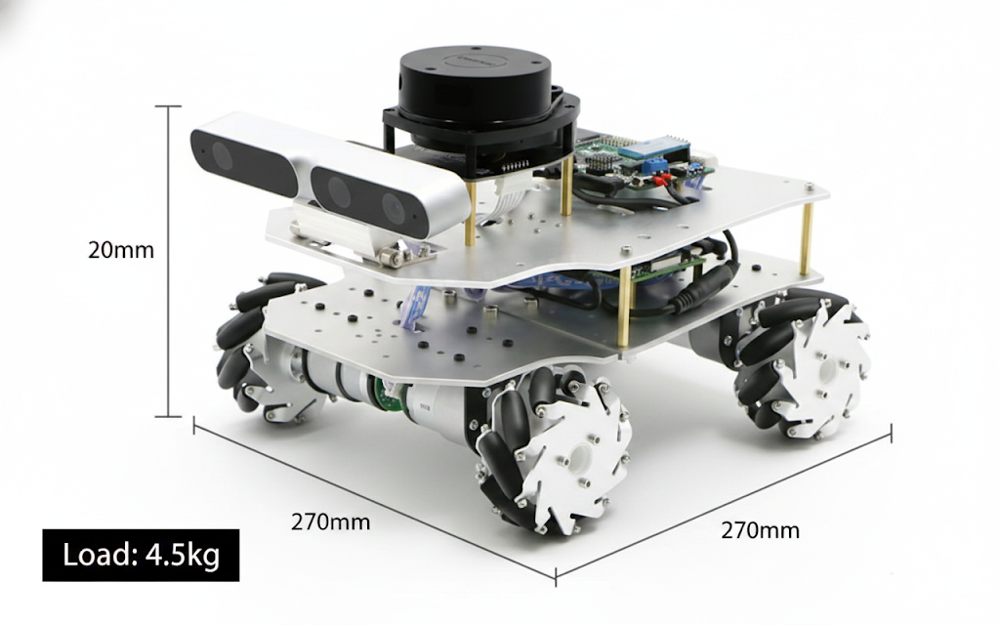
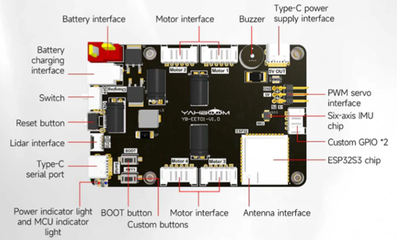
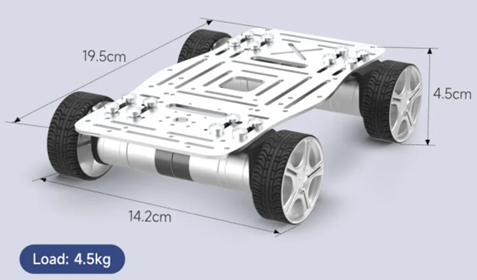
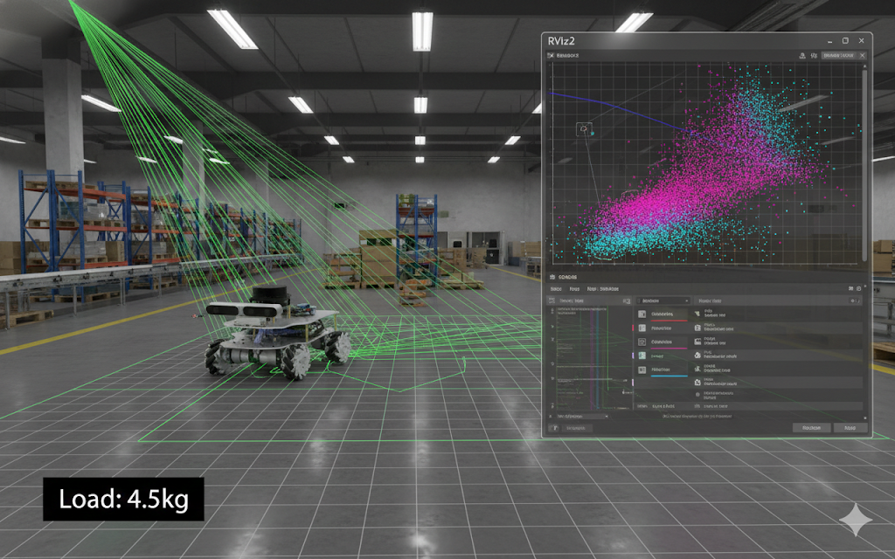

## 1. Introduction: Why Build It Yourself? (Motivation)

There are many excellent autonomous robot kits on the market costing well over $1,000. However, for an engineer, the true value lies not in buying a finished product, but in understanding **"why it was built that way."**

* **Cost Efficiency**: Achieving core functionalities at 1/5 the price of commercial kits.
* **Customization**: Optimizing sensor placement and firmware to suit my specific needs.
* **Sense of Achievement**: When I go through the effort of gathering acrylic, 3D printer parts, and various components to assemble them, and the result looks better than I expected, I feel a sense of accomplishment. That feeling grows even more when I see it trying to perform autonomous driving functions, even if not perfectly.

This is the image of a stunning autonomous vehicle I found on the internet, and it serves as the role model I aspire to.  Of course, I don’t think I’ll be able to make it exactly the same, but I believe that’s perfectly fine. What truly matters to me is the process of creating it.

---

## 2. Choosing the Brain: ESP32 and micro-ROS

This time, instead of using an STM32 board, I chose an ESP32 autonomous driving board. The reason is ROS2, since the ESP32 supports microROS:

* **Official micro-ROS Support**: It offers seamless integration with micro-ROS, unlike the more complex setup required for STM32.
* **Connectivity**: Built-in Wi-Fi and Bluetooth allow for effortless wireless data exchange with my VMware host.
* **Expandability**: Dedicated ports for Lidar and 4-axis encoder motors are a huge plus.

> **Technical Tip**: I use a pre-configured VMware image for the development environment. It comes with ESP-IDF and ROS 2 Humble (including Gazebo and Rviz2), drastically reducing setup time.

---

## 3. Chassis and Drivetrain: Aluminum Rigidity and 310 Motors

I selected an **aluminum-based chassis** for the robot's frame, as structural rigidity directly translates to data precision.

* **310 Encoder Motors**: These provide precise feedback on wheel rotations, minimizing errors during SLAM (Simultaneous Localization and Mapping).
* **Multi-tiered Structure (Base Plate)**: I designed an additional upper plate using **Fusion 360**, to be laser-cut from acrylic or 3D printed. This ensures an unobstructed field of view for the Lidar and Camera.

---

## 4. Software Architecture and Final Goals

If the hardware is the body, the software is the intelligence.

1. **Hybrid Control**: Performing ROS 2 tests using a Raspberry Pi or a remote micro-ROS Agent on VMware.
2. **AI Collaboration (Gemini)**: Porting the T-mini Lidar driver by collaborating with Google's Gemini AI to analyze hardware specs and protocols.
3. **The Ultimate Goal**: Completing a SLAM map and developing a system that can execute navigation commands autonomously.

---

## Closing Thoughts

I often think back to my college days in the lab. Back then, I had to wander through offline parts markets, and there were many times I gave up after trying to build everything on my own. That was because software, hardware, and mechanics all had to come together. How about now? Thanks to AI and the growth of online shopping, I feel that it has become much easier to find and create everything. Yet, what truly matters is our own determination, planning, and design. Even if it’s something small, trying it out—that, I believe, is the most important thing.