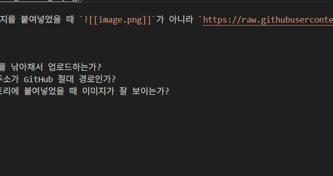

## 1. 연동 확인
이 포스팅은 옵시디언에서 작성되었으며, 이미지가 나의 GitHub 저장소인 **Soft Breeze Lab**의 `/assets/images` 폴더로 잘 올라가는지 테스트하기 위한 용도입니다.

## 2. 이미지 테스트
아래에 이미지를 붙여넣어 보세요. (캡처 후 Ctrl+V)

> **확인 사항:** 이미지를 붙여넣었을 때 `![[image.png]]`가 아니라 `https://raw.githubusercontent.com/...` 링크가 생성되어야 합니다.

## 3. 결과 체크리스트
* [ ] PicGo가 이미지를 낚아채서 업로드하는가?
* [ ] 본문의 이미지 주소가 GitHub 절대 경로인가?
* [ ] 이 내용을 티스토리에 붙여넣었을 때 이미지가 잘 보이는가?