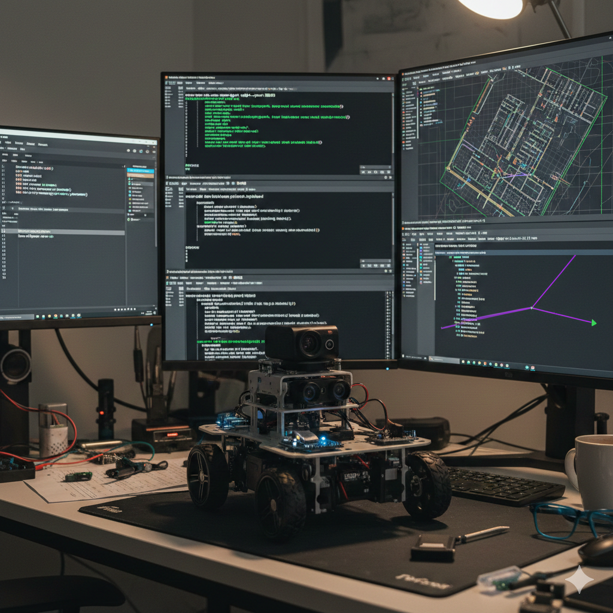

# SLAM Robot Project: From Firmware to Navigation

## 1. Uploading Firmware to ESP32
Before running ROS 2 nodes, ensure the micro-ROS firmware is running on your robot's controller.
Open the micro-ROS project in your IDE (e.g., Arduino IDE or PlatformIO).
Configure your WiFi SSID/Password and the PC IP Address (Agent IP).
Set the Agent Port to 8090.
Flash the code to the ESP32 board.

## 2. Start micro-ROS Agent
The agent acts as a bridge between the robot (ESP32) and the ROS 2 environment.

Terminal 1
```bash
source ~/uros_ws/install/setup.bash
export ROS_DOMAIN_ID=15
ros2 run micro_ros_agent micro_ros_agent udp4 --port 8090
```
## 3. Manual Control Test

Check the communication by moving the robot using your keyboard.
Terminal 2
```bash
export ROS_DOMAIN_ID=15
ros2 run teleop_twist_keyboard teleop_twist_keyboard
```
## 4. SLAM (Map Building)

Generate a 2D map of your environment using LiDAR data.
Terminal 3: Run Gmapping
```bash
cd ~/gmapping_ws
source install/setup.bash
export ROS_DOMAIN_ID=15
ros2 launch slam_gmapping slam_gmapping.launch.py
```
Terminal 4: Visualization
```bash
export ROS_DOMAIN_ID=15
rviz2
```
In RViz2: Set Fixed Frame to map. Add Map and LaserScan displays.
Action: Move the robot slowly using the keyboard to fill the map.

## 5. Saving the Map

Once the map is complete, save it to files (.yaml and .pgm).

Terminal 5
```bash
export ROS_DOMAIN_ID=15
ros2 run nav2_map_server map_saver_cli -f ~/my_new_map
```
## 6. Autonomous Navigation

Use the saved map to let the robot navigate by itself.

Stop the SLAM and Teleop nodes (Ctrl+C).

Run Navigation:

Terminal 6
```bash
cd ~/yahboomcar_ws
source install/setup.bash
export ROS_DOMAIN_ID=15
ros2 launch yahboomcar_nav navigation_dwb_launch.py map:=/home/yahboom/my_new_map.yaml
```
In RViz2:

Use 2D Pose Estimate to align the robot's current position on the map.
Use Nav2 Goal to set a destination. The robot will move autonomously.

