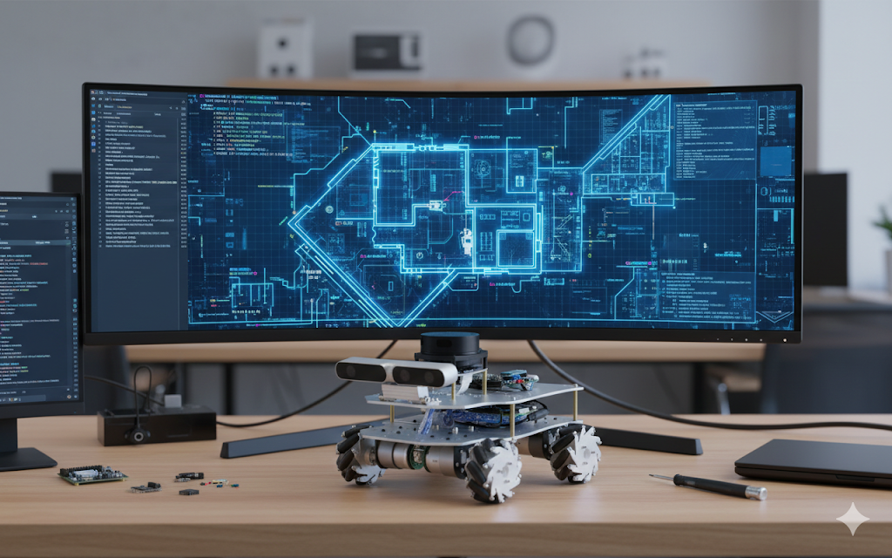
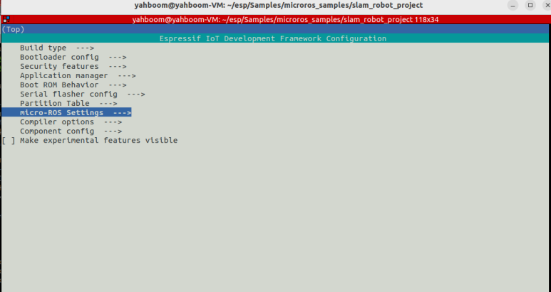

## 



## 1. Uploading Firmware to ESP32
Before running ROS 2 nodes, ensure the micro-ROS firmware is running on your robot's controller.
Open the micro-ROS project in your IDE (e.g., Arduino IDE or PlatformIO).
Configure your WiFi SSID/Password and the PC IP Address (Agent IP).
Set the Agent Port to 8090.

```bash
$ source ~/esp/esp-idf/export.sh
$ idf.py set-target esp32s3
$ idf.py menuconfig
```
Flash the code to the ESP32 board.

```bash
$ idf.py flash monitor
$ idf.py -p /dev/ttyUSB0 flash monitor  # port
```

## 2. Start micro-ROS Agent
The agent acts as a bridge between the robot (ESP32) and the ROS 2 environment.

Terminal 1
```bash
source ~/uros_ws/install/setup.bash
export ROS_DOMAIN_ID=15
ros2 run micro_ros_agent micro_ros_agent udp4 --port 8090
```
## 3. Manual Control Test

Check the communication by moving the robot using your keyboard.
Terminal 2
```bash
export ROS_DOMAIN_ID=15
ros2 run teleop_twist_keyboard teleop_twist_keyboard
```
## 4. SLAM (Map Building)

Generate a 2D map of your environment using LiDAR data.
Terminal 3: Run Gmapping
```bash
cd ~/gmapping_ws
source install/setup.bash
export ROS_DOMAIN_ID=15
ros2 launch slam_gmapping slam_gmapping.launch.py
```
Terminal 4: Visualization
```bash
export ROS_DOMAIN_ID=15
rviz2
```
In RViz2: Set Fixed Frame to map. Add Map and LaserScan displays.
Action: Move the robot slowly using the keyboard to fill the map.

## 5. Saving the Map

Once the map is complete, save it to files (.yaml and .pgm).

Terminal 5
```bash
export ROS_DOMAIN_ID=15
ros2 run nav2_map_server map_saver_cli -f ~/my_new_map
```
## 6. Autonomous Navigation

Use the saved map to let the robot navigate by itself.

Stop the SLAM and Teleop nodes (Ctrl+C).

Run Navigation:

Terminal 6, for simple navigation.

```bash
export ROS_DOMAIN_ID=15
ros2 launch nav2_bringup bringup_launch.py map:=/home/go/my_maps/my_2nd_map.yaml
```
You may edit your own navigation params.
```bash
mkdir -p ~/navi
cp $(ros2 pkg prefix nav2_bringup)/share/nav2_bringup/params/nav2_params.yaml ~/navi/my_nav2_params.yaml
vi ~/navi/my_nav2_params.yaml # for detail

# for navigation
ros2 launch nav2_bringup bringup_launch.py use_sim_time:=False params_file:=/home/go/navi/my_nav2_params.yaml map:=/home/go/my_maps/my_2nd_map.yaml

```


```bash
ros2 run rviz2 rviz2 -d $(ros2 pkg prefix nav2_bringup)/share/nav2_bringup/rviz/nav2_default_view.rviz
```

In RViz2:

Use 2D Pose Estimate to align the robot's current position on the map.
Use Nav2 Goal to set a destination. The robot will move autonomously.

