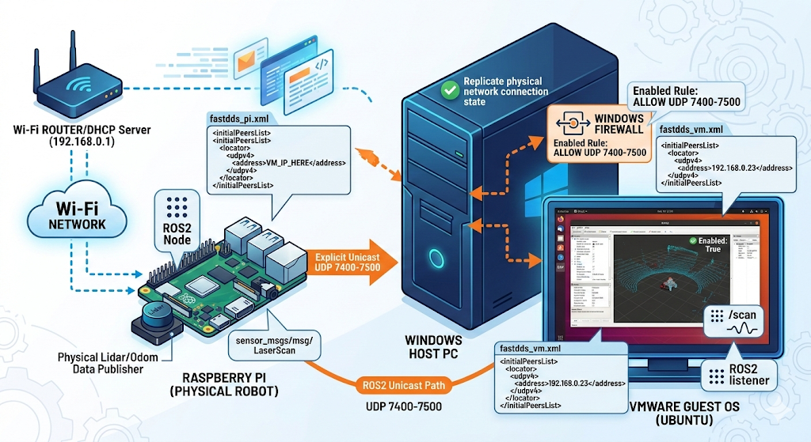

When working with **ROS2 Humble** in a mixed environment involving a physical **Raspberry Pi** and a **VMware Guest OS (Ubuntu)**, the default Multicast-based discovery often fails due to Wi-Fi bridge limitations or host firewalls.

This post details how to bypass these issues using **FastDDS Unicast (Initial Peers)** and Windows Firewall configuration.



## 1. The Problem: Multicast Silently Dropped

In a typical Wi-Fi Bridge setup, the "discovery" packets (Multicast) sent by ROS2 nodes are frequently dropped.
- **Symptoms**: `ros2 topic list` is empty.
- **Cause**: Routers or VMware Bridge adapters often filter out IGMP/Multicast traffic.

## 2. The Solution: Explicit Unicast (Initial Peers)

We can force ROS2 to use **Unicast** by providing an explicit list of IP addresses.

### Creating the XML Configuration

Create a `fastdds_profile.xml` on both machines.

**On Raspberry Pi (e.g., 192.168.0.23):**
```xml
<?xml version="1.0" encoding="UTF-8" ?>
<profiles xmlns="[http://www.eprosima.com/XMLSchemas/fastrtps_profiles](http://www.eprosima.com/XMLSchemas/fastrtps_profiles)">
    <participant profile_name="unicast_profile" is_default_profile="true">
        <rtps>
            <builtin>
                <initialPeersList>
                    <locator><udpv4><address>192.168.0.XX</address></udpv4></locator>
                </initialPeersList>
            </builtin>
        </rtps>
    </participant>
</profiles>
```

**On VMware Ubuntu:**
```xml
<?xml version="1.0" encoding="UTF-8" ?>
<profiles xmlns="[http://www.eprosima.com/XMLSchemas/fastrtps_profiles](http://www.eprosima.com/XMLSchemas/fastrtps_profiles)">
    <participant profile_name="unicast_profile" is_default_profile="true">
        <rtps>
            <builtin>
                <initialPeersList>
                    <locator><udpv4><address>192.168.0.23</address></udpv4></locator>
                </initialPeersList>
            </builtin>
        </rtps>
    </participant>
</profiles>
```
**Applying the Configuration**
Add the following to your ~/.bashrc to make it persistent:
```
export FASTRTPS_DEFAULT_PROFILES_FILE=~/fastdds_profile.xml
```
## 3. Configuring Windows Host Firewall
The Windows Host might still block incoming UDP traffic to the VM. Use PowerShell (Admin) to open the necessary DDS ports:

PowerShell
```
New-NetFirewallRule -DisplayName "ROS2_Unicast_In" -Direction Inbound -Protocol UDP -LocalPort 7400-7500 -Action Allow
```

## 4. Verification
After rebooting all devices, verify the connection:

```bash
# Running on VMware Ubuntu
ros2 topic hz /scan
Result:

Plaintext
average rate: 5.850
min: 0.080s max: 0.321s std dev: 0.05819s window: 54
```

Success! The Lidar data is now streaming perfectly.

## 5. Troubleshooting & Maintenance

### Common Issues and Solutions

* **IP Address Mismatch:**
    If your communication stops after a reboot, verify the IP addresses. If the DHCP server (router) assigns a new IP to the VM, you must update the `<address>` tag in the Raspberry Pi's `fastdds_pi.xml` file.
    - Check IP: `hostname -I`

* **Firewall Status:**
    If the VM is not receiving data, ensure the Windows Host firewall rule is still enabled.
    - Check Rule (PowerShell Admin): `Get-NetFirewallRule -DisplayName "ROS2_Unicast_In" | Select-Object Enabled`

* **XML Loading Failure:**
    If you see `[XMLPARSER Error]`, double-check the file path in your `~/.bashrc`.
    - Command: `cat ~/.bashrc | grep FASTRTPS`

### Essential CLI Commands for Quick Testing

To verify the connection between the Raspberry Pi and VMware, use these standard ROS2 commands:

**1. Basic Connectivity Test**
```bash
# Terminal 1 (VM)
ros2 run demo_nodes_cpp listener

# Terminal 2 (Pi)
ros2 run demo_nodes_cpp talker
```
