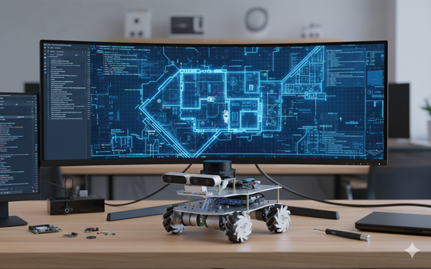
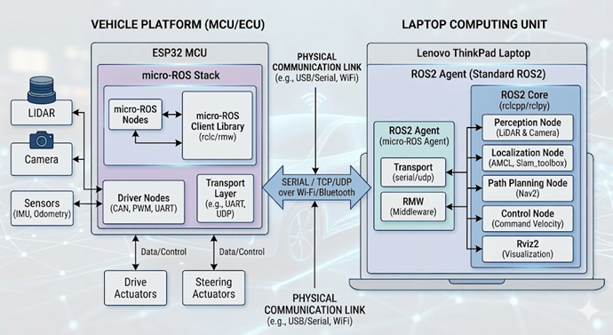
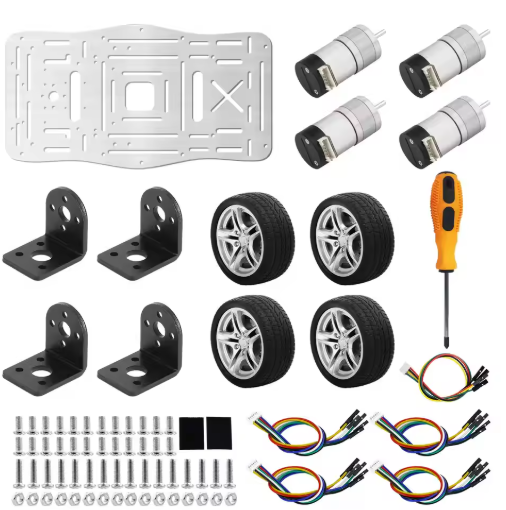
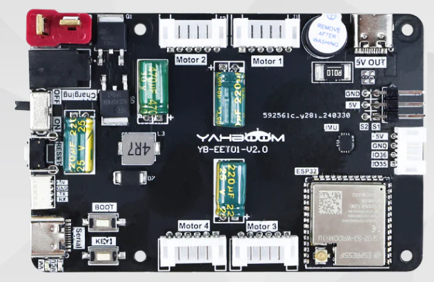
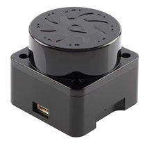
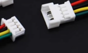
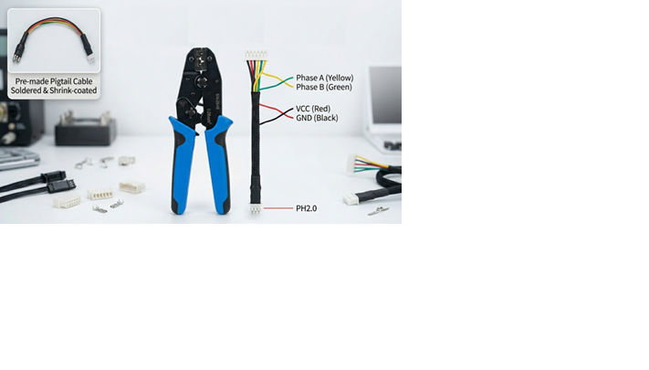
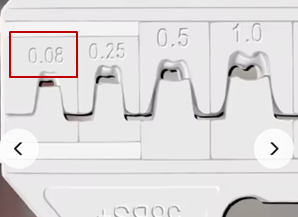
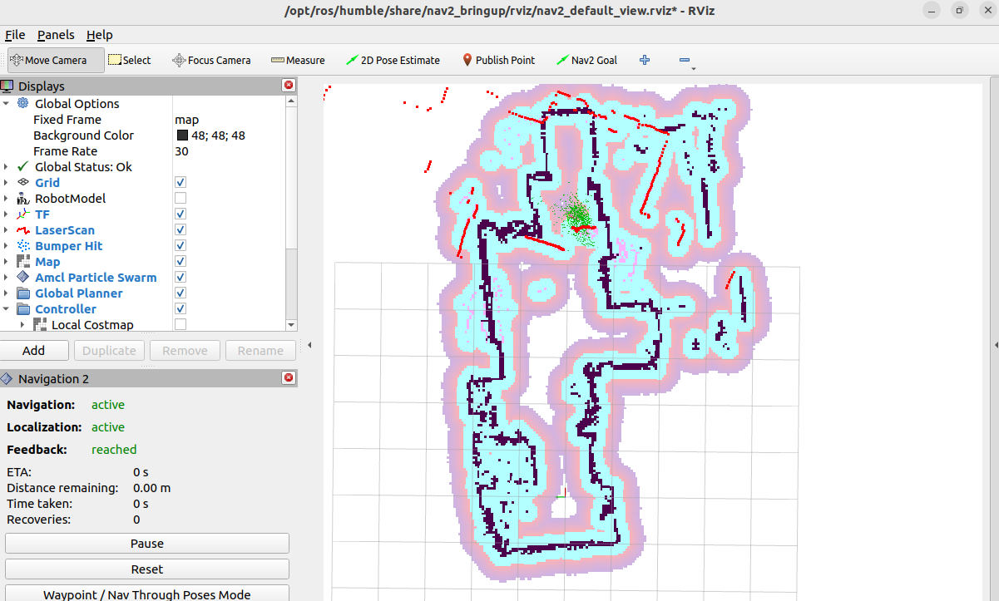
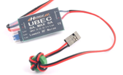

## Overview
This project documents the development of a DIY autonomous vehicle using **ESP32 micro-ROS**.  
Previous experiments included STM32-based balancing robots and Raspberry Pi car kits with Lidar.  
Ultimately, the architecture transitioned to **ROS2 Humble**, with ESP32 handling IMU, Lidar, and odometry, while higher-level tasks ran on Raspberry Pi or a remote laptop.

---

## Architecture
### Architecture Overview
This diagram illustrates a high-level micro-ROS and ROS2 hybrid architecture for an autonomous vehicle. The system is designed to split workloads between a low-level microcontroller for hardware interfacing and a high-level computing unit for complex processing.

### 1. Vehicle Platform (ESP32 MCU)
The left side of the diagram represents the real-time hardware interface. The ESP32 acts as the bridge between the physical sensors/actuators and the main software stack.

micro-ROS Stack: It runs lightweight micro-ROS Nodes and a Client Library (rclc/rmw) specifically optimized for resource-constrained hardware.

Driver Nodes: These manage low-level communication protocols such as CAN, PWM, and UART.

Hardware I/O: It directly interfaces with various sensors (LiDAR, Camera, IMU, Odometry) and controls physical Drive and Steering Actuators.

### 2. Laptop Computing Unit (Standard ROS2)
The right side represents the central intelligence, typically running on a powerful laptop (e.g., Lenovo ThinkPad) using a full ROS2 installation.

ROS2 Agent (micro-ROS Agent): This is the critical middleware component that allows the micro-ROS nodes on the ESP32 to communicate seamlessly with the rest of the ROS2 ecosystem.

ROS2 Core & High-Level Nodes: This unit handles high-compute tasks that an MCU cannot perform:

Perception: Processing data from LiDAR and Cameras.

Localization: Determining position using AMCL or Slam_toolbox.

Path Planning: Navigating the environment using the Nav2 stack.

Control: Sending movement commands (Command Velocity).

Visualization: Monitoring the system state in real-time via Rviz2.

### 3. Communication Link
The two systems are bridged via a Physical Communication Link, ensuring data flow between the vehicle hardware and the computing unit.

Protocols: Data is exchanged using SERIAL, TCP, or UDP.

Physical Media: This can be established over USB/Serial, Wi-Fi, or Bluetooth, depending on whether the setup is tethered or wireless.

## Hardware

### Chassis
- Accurate odometry requires a robust chassis.
- Encoder motors mounted on aluminum plates for durability.
- Selected **Encoder Motor 310** for reliability.
- Initial camera gimbal was removed; future plan includes a depth camera.
- Current setup uses a **3D-printed Lidar mount**.

### ESP32 micro-ROS Board
- Supports:
  - 4 encoder motors
  - 2 servos
  - 1 custom serial port
  - Integrated IMU
- Power: 7.4V T-type connector.
- Includes 5V, 4A USB-C port for Raspberry Pi.
- Mounting holes align with Raspberry Pi for stack integration.

### T-mini Plus TOF Lidar
- No native micro-ROS driver available.
- Custom driver created in `idf.py` build environment.
- Firmware rebuilt using available source code.
- GitHub link to driver source provided in related blog entry.

### Cabling
- Lidar requires **JST GH1.25 4-pin** connector.
- ESP32 board uses **JST Molex PicoBlade 4-pin**.
- RX/TX crossover wiring required.
- Careful color matching for VCC, GND, RX, TX.

### Encoder Motor Cabling
- Default cables too long; shortened using crimping tool.
- First-time use of **PH2.0 JST sockets**.
- Tool purchase requires attention, but PH2.0 is widely applicable.

- For PH2.0, 

---

## Software

- ROS2 Humble installed on Ubuntu acts as the **micro-ROS agent**.
- ESP32 firmware built with `idf.py menuconfig`:
  - Wi-Fi configured.
  - Agent IP set.
- Important note:
  - ESP32 requires an antenna for Wi-Fi.
  - Without antenna, deserialization errors occur.
- ROS2 command references available in earlier blog posts.

---

## SLAM Mapping and Autonomous Driving

### Process
- SLAM map creation requires slow, careful movement.
- Recommended tools:
  - `teleop_twist_keyboard`
  - Custom control applications
- Best practices:
  - Use rotation (`j`, `l` keys) instead of reverse.
  - Cover reflective surfaces (e.g., windows).
  - Ensure clear black wall outlines in the map.

### Result
- Successfully generated SLAM map.
- Achieved basic autonomous driving in **rviz2**.
- Test confirmed feasibility of navigation.

---

## Reflections

- Cable reliability was critical; avoided contact failures.
- Power stability ensured with **UBEC**.
- micro-ROS workload on ROS2 was significant due to multiple processes.
- Limitations:
  - ESP32 supports only 1 Node, 3 Publishers, 3 Subscribers.
  - TF and camera image processing handled on ROS2 agent instead.
- First-time CAD design and 3D printing for Lidar mount:
  - Result was functional and effective.
- Project timeline:
  - Preparation, execution, and testing took ~1 month.
  - Delays mainly due to shipping; software prepared during waiting period.

  

### Key Takeaways
- Attempting the build was essential—progress only comes through action.
- AI assistance played a crucial role in problem-solving and guidance.
- The project provided hands-on experience across hardware, software, and mechanics.

---