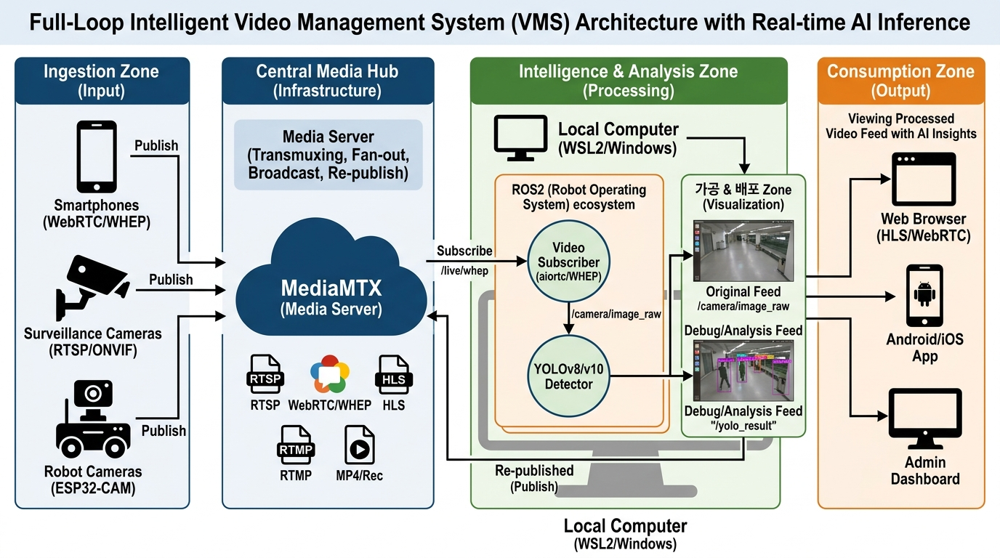

## MediaMTX



## WebRTC to ROS2 /image_raw publisher

### ROS2 package
```python
import rclpy
from rclpy.node import Node
from sensor_msgs.msg import Image
from cv_bridge import CvBridge
import cv2
import asyncio
import threading
import requests
from aiortc import RTCPeerConnection, RTCSessionDescription, MediaStreamTrack
from av import VideoFrame

class WebRTCReceiver(Node):
    def __init__(self):
        super().__init__('webrtc_receiver')

        # ✅ MediaMTX connect url definition
        self.declare_parameter('whep_url', 'http://172.18.33.238:8889/live/whep')
        self.whep_url = self.get_parameter('whep_url').get_parameter_value().string_value

        self.publisher_ = self.create_publisher(Image, 'camera/image_raw', 10)
        self.bridge = CvBridge()
        
        self.pc = RTCPeerConnection()
        self.loop = asyncio.new_event_loop()
        
        # ✅ Callback after successful connection
        @self.pc.on("track")
        def on_track(track):
            if track.kind == "video":
                self.get_logger().info("🎥 Starting Video Track receiving !")
                asyncio.run_coroutine_threadsafe(self.process_track(track), self.loop)

        # ✅ asyncio loop in Threading.
        self.thread = threading.Thread(target=self.start_async_loop, daemon=True)
        self.thread.start()

        # ✅ WHEP Handshake
        asyncio.run_coroutine_threadsafe(self.connect_whep(), self.loop)

    def start_async_loop(self):
        asyncio.set_event_loop(self.loop)
        self.loop.run_forever()

    async def connect_whep(self):
        try:
            # 1. Offer Creation
            self.pc.addTransceiver("video", direction="recvonly")
            offer = await self.pc.createOffer()
            await self.pc.setLocalDescription(offer)

            # 2. WHEP POST to MediaMTX
            headers = {'Content-Type': 'application/sdp'}
            response = requests.post(self.whep_url, data=self.pc.localDescription.sdp, headers=headers, timeout=5)

            if response.status_code == 201 or response.status_code == 200:
                # 3. Answer SDP Receiving
                answer = RTCSessionDescription(sdp=response.text, type="answer")
                await self.pc.setRemoteDescription(answer)
                self.get_logger().info("✅ WHEP Handshake success !")
            else:
                self.get_logger().error(f"❌ WHEP connection failed : {response.status_code} - {response.text}")
        except Exception as e:
            self.get_logger().error(f"❌ Connection error ! : {str(e)}")

    async def process_track(self, track):
        while rclpy.ok():
            try:
                frame = await track.recv()
                # PyAV frame to numpy(BGR)
                img = frame.to_ndarray(format="bgr24")
                
                # ROS2 Message publishing
                msg = self.bridge.cv2_to_imgmsg(img, encoding="bgr8")
                msg.header.stamp = self.get_clock().now().to_msg()
                msg.header.frame_id = "camera_link"
                self.publisher_.publish(msg)
            except Exception as e:
                self.get_logger().warn(f"⚠️ Error during receiving data : {e}")
                break

    def stop(self):
        self.loop.stop()
        self.pc.close()

def main(args=None):
    rclpy.init(args=args)
    node = WebRTCReceiver()
    try:
        rclpy.spin(node)
    except KeyboardInterrupt:
        pass
    finally:
        node.stop()
        node.destroy_node()
        rclpy.shutdown()

```


```bash
pip install aiortc aiohttp opencv-python cv_bridge
cd ~/ros2_ws
colcon build --packages-select webrtc_receiver
source install/setup.bash
ros2 run webrtc_receiver receiver_node --ros-args -p whep_url:="http://172.18.33.238:8889/live/whep"
```


## YOLO to WebRTC

```python
import rclpy
from rclpy.node import Node
from sensor_msgs.msg import Image
from cv_bridge import CvBridge
import asyncio
import threading
import requests
from aiortc import RTCPeerConnection, RTCSessionDescription, VideoStreamTrack
from av import VideoFrame

class RelayTrack(VideoStreamTrack):
    def __init__(self):
        super().__init__()
        self.frame = None

    async def recv(self):
        pts, time_base = await self.next_timestamp()
        if self.frame is not None:
            # ROS 이미지를 PyAV 프레임으로 변환
            new_frame = VideoFrame.from_ndarray(self.frame, format="bgr24")
            new_frame.pts = pts
            new_frame.time_base = time_base
            return new_frame

class SimpleRelay(Node):
    def __init__(self):
        super().__init__('yolo_relay')
        self.sub = self.create_subscription(Image, '/yolo/dbg_image', self.cb, 10)
        self.bridge = CvBridge()
        self.track = RelayTrack()
        self.pc = RTCPeerConnection()
        self.loop = asyncio.new_event_loop()
        
        # WHIP 주소 (MediaMTX 경로)
        self.url = 'http://172.18.33.238:8889/yolo_result/whip'

        threading.Thread(target=self.loop.run_forever, daemon=True).start()
        asyncio.run_coroutine_threadsafe(self.connect(), self.loop)

    def cb(self, msg):
        # 토픽 받아서 트랙에 넣어주기만 함
        self.track.frame = self.bridge.imgmsg_to_cv2(msg, "bgr8")

    async def connect(self):
        self.pc.addTrack(self.track)
        offer = await self.pc.createOffer()
        await self.pc.setLocalDescription(offer)
        res = requests.post(self.url, data=self.pc.localDescription.sdp, headers={'Content-Type': 'application/sdp'})
        await self.pc.setRemoteDescription(RTCSessionDescription(sdp=res.text, type="answer"))
        self.get_logger().info("🚀 릴레이 시작됨!")

def main():
    rclpy.init()
    node = SimpleRelay()
    try:
        rclpy.spin(node)
    except:
        pass
    finally:
        rclpy.shutdown()

if __name__ == '__main__':
    main()

```

You can access http://192.168.0.44:8889/yolo_result via http://192.168.0.44:8889/live/yolo_result/whep


