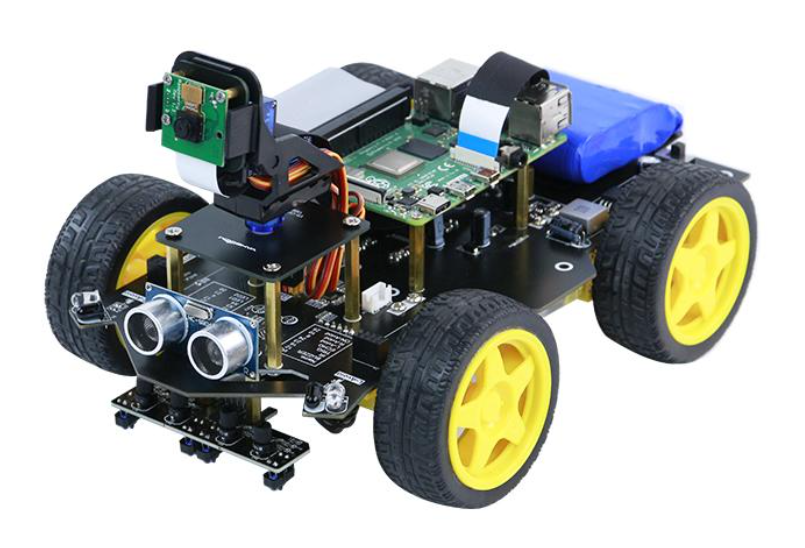
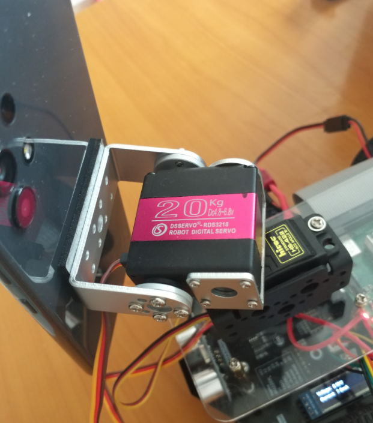
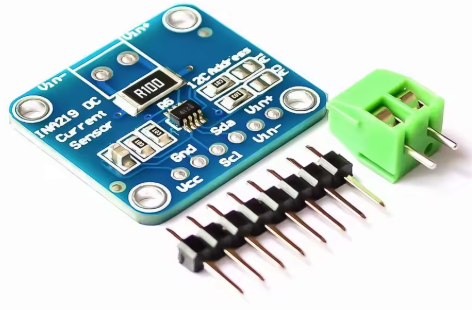
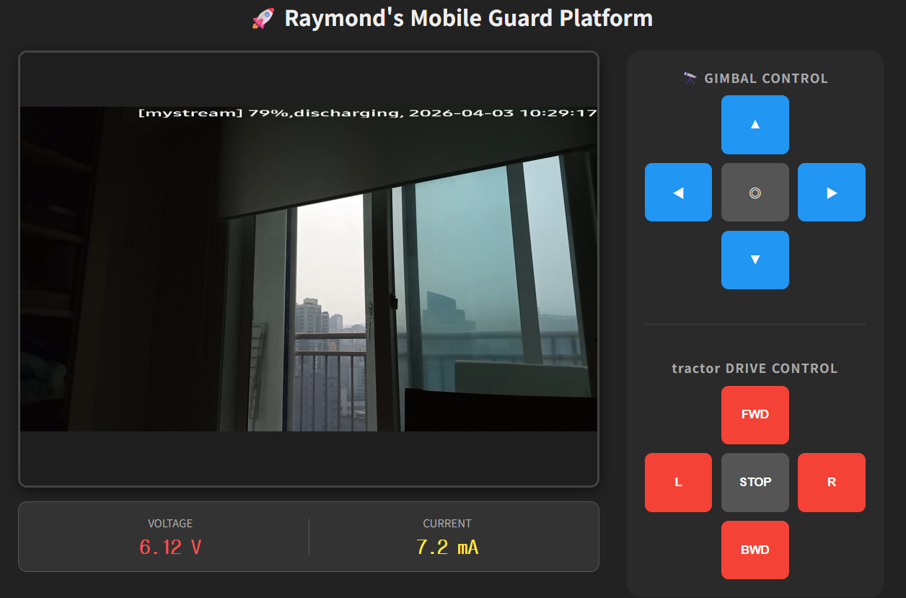

## Purpose
I had an old Raspberry Pi 3B (RAM: 1GB) lying around, along with a kit called RaspBot. And like many households, I also had an outdated smartphone—SIM card removed, too old to sell, yet too functional to throw away.

The kit included a Raspberry Pi camera, but the resolution was unimpressive and not very practical. So I decided to add a gimbal and a smartphone mount to make the setup more useful. The end result looked like this:

In the photo, you can see a 20KG servo installed. This RDS3218 servo replaced the MG996R that had previously failed. It cost several times more, but its dual‑axis metal bearing design, compact size, and clean signal processing with minimal vibration made it worth it. So far, I’m satisfied. Although the torque required for the smartphone and mount is far below 20KG, the MG996R couldn’t handle it and sagged when powered off. The RDS3218, however, holds its position even without power.

## Current Sensor (INA219)
The RaspBot board is solidly built and surprisingly affordable. With a 3‑cell 18650 battery pack, charger, sensors, Raspberry Pi camera, motors, and wheels, the whole kit cost around $60. One of its strengths is the built‑in ports for a Bluetooth module (HC06) and a 0.91" OLED, plus two I2C ports—perfect for expansion if you’ve tinkered with Arduino before.

On the I2C side, I added an MPU6050 IMU to improve wheel straightness with DC motors, and an INA219 sensor to monitor overcurrent caused by gimbal torque. Voltage and current can be checked instantly on the OLED, or via a Flask web server on the Raspberry Pi. In fact, the system can even cut power automatically if overcurrent is detected.

## Streaming Server: MediaMTX
Despite the Raspberry Pi 3B’s limited memory (about 1GB), MediaMTX ran smoothly. With proper router settings, it can be accessed externally, and WebRTC makes real‑time streaming possible. The old Android smartphone streams via RTMP protocol, and MediaMTX handles the rest.
Configuration was minimal—just enabling WebRTC was enough

## Android App Development
At first, I used Prism Live, a broadcasting app. But the ads were overwhelming, and it required the screen to stay on, which was inconvenient and caused overheating. So I decided to build my own Android app.
AI helped me get started quickly, but video handling was tricky. Android’s security policies made background camera access, Wi‑Fi usage, and power management difficult. Even mirroring the front camera horizontally wasn’t straightforward.
It wasn’t a perfect success, but I managed to work around most issues using alarm‑based triggers. I haven’t tested it on newer phones, but Android’s security policies vary so much by version that challenges are inevitable. I now understand why Prism Live keeps the screen on—it’s a workaround that aligns with Android’s implicit alarm policies.

## Web Server
Using Python Flask, I built a simple interface. Since monitoring servo current is critical, I made sure to include it. The code was generated by AI—I didn’t write it myself.

The web interface allows me to control the servo and make small adjustments.

## Reflections
The RaspBot normally supplies 12.6V, but I used a variable voltage regulator (5A, 3V–12.6V) and a UBEC (5/6/7.4V, 6A) to power the servo separately. Building this system taught me that mechanical gimbal structures, servos, and power supplies must be carefully balanced, and safety mechanisms are essential. For the first time, I realized I should add a blade fuse—because safety matters most. Even though this is a home project, that makes safety even more important.

