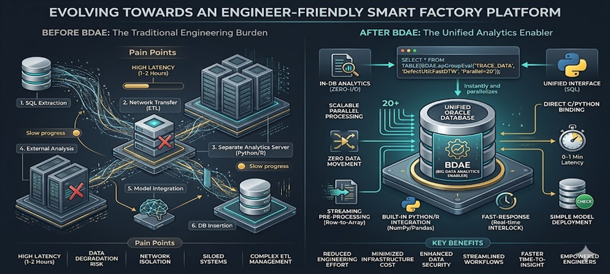
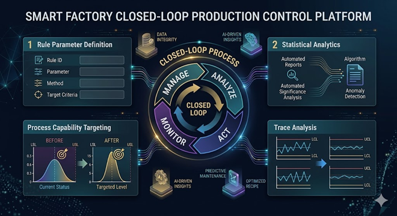

## SQL-based AI Inference Engine for Semiconductor Fabs
SCP BigQuery joined the fray late as well. It involves binding data with analytics to receive results as a standard SQL query output. However, the **Big Data Analysis Enabler (BDAE)** differs in that it is more analyst (user) centric, allowing users to create and apply their own algorithms in real-time. Algorithms for anomaly detection or virtual metrology vary across different semiconductor processes and equipment. This becomes even more critical as equipment becomes more sophisticated. BDAE was created to perform real-time inference specifically for Oracle Database environments.



This document is intended for those who work with Oracle Databases. Generally, development follows a common pattern: creating SQL queries and calling them from the backend. For analytics, an analysis server typically fetches raw data from the Oracle Database. In some cases, part of the data is pre-processed using Oracle functions or PL/SQL before being transferred.


## Programming in Oracle Database
Programs within an Oracle Database can be implemented in roughly three ways. Excluding functions that operate on individual rows and PL/SQL cases without return values, the **Pipelined Table Function** is the most effective and performance-oriented pre-processing technique for analytics.

| Category | Scalar Function | Standard PL/SQL | Pipelined Table Function |
|:--- |:--- |:--- |:--- |
| **Return Method** | Single Value (Scalar) | None (DML centric) | Result Set |
| **Memory Usage** | Low | Very High (During Bulk loading) | Optimized (Streaming) |
| **SQL Integration** | High (Used in SELECT clause) | Low | Very High (Used in FROM clause) |
| **Parallel Processing** | Limited | Requires Manual Management | Native Support (Parallel_Enable) |
| **Primary Use** | Simple formatting, calculation | Massive batch jobs | High-performance pre-processing/transformation |

## Pipelined Table Function
### 1. Concept
A **Pipelined Table Function** is an Oracle structure that is a function but returns results like a table.

- Standard Function → Returns all results at once.
- Pipelined → **Returns results row-by-row via streaming.**

---

### 2. 왜 사용하는가 (핵심 가치)
Why Use It (Core Value)
**Standard PL/SQL:**
- Loads everything into memory → Returns all at once.
- Result: Slow performance and high memory consumption.

**Pipelined:**
- **Returns lines immediately using PIPE ROW.**
- Result: **Memory savings + Fast processing (especially for large datasets).**

---

### 3. Basic Structure
This is a very simplified form. While more sophisticated implementations shouldn't be structured exactly like this, here is a basic example:

```sql
CREATE OR REPLACE TYPE t_row AS OBJECT (
  col1 NUMBER,
  col2 VARCHAR2(100)
);
/

CREATE OR REPLACE TYPE t_table AS TABLE OF t_row;
/

CREATE OR REPLACE FUNCTION fn_pipe
RETURN t_table PIPELINED
IS
BEGIN
  FOR r IN (SELECT * FROM some_table) LOOP
    PIPE ROW(t_row(r.col1, r.col2));
  END LOOP;

  RETURN;
END;
/
```
### 4. Execution
```sql
SELECT * FROM TABLE(fn_pipe());
```

## Pipelined Table Function Style of Big Data Analysis Enabler

BDAE also utilizes the Pipelined Table Function. However, it uses a form with many arguments, as analytics is rarely simple. The first cursor represents the source data, while the second cursor contains reference data or various arguments for Python/R.
The output is explicitly specified, and the SQL statement is completed with the Python or R module name and the starting function name to be called.

It can be called just like a standard SQL statement.

```sql
SELECT  * /*+ parallel(20) */
FROM TABLE (apGroupEvalParallel (
     cursor ( 
        SELECT * 
        FROM TRACE_DATA
        WHERE EQP_ID = ‘EPS001’
          AND LOT_ID = ‘LOT001’
          AND ETC = ‘…..’
        ), 
     cursor(SELECT * FROM GOLDEN_EQUIPMENT ...),
     ‘SELECT  CAST(‘’A’’ AS VARCHAR2(40)) PARAMETER_ID,  
              1.0 SIMILARITY FROM DUAL’,
      ‘EQP_ID, LOT_ID, ....’,
      ‘DefectUtil:FastDTW’);

```
The results are displayed as follows:

|  PARAMETER_ID    |  SIMILARITY
|------------------|------------
| RF_POWER_1       |  2.23
| O2_PUMP_1        |      0.5
| Ch1_TEMP_1       |      2.1
| ………              |    ……
| ………              |    ……

## SmartFactory Area
Moving massive amounts of data for real-time inference? To prevent this, performing inference immediately within the Oracle In-Database using Python is highly effective. It is my personal philosophy, but it is a fact.

The reason for creating the Big Data Analysis Enabler was to perform immediate defect analysis in environments where Oracle Database must be used, which requires minimizing data movement. While model training can occur on other systems, it is desirable for the model inference to take place within the production system.

### Example: Anomaly Detection
If you were to perform simple anomaly detection based on variations in equipment parameter dispersion, it could be done as follows:



To achieve this, especially with large-scale data in real-time, one would typically run multiple queries to bring data to an analysis server, calculate descriptive statistics, and detect outliers according to defined Spec Rules. BDAE solves this with a single SQL statement.

```sql
SELECT *
FROM TABLE(apGroupEvalParallel(
    CURSOR(
        SELECT ...
        FROM FDC_TRACE
    ),
    NULL,
    'ANOMALY_VIEW',
    'EQP_ID,UNIT_ID,...',
    'AnomalyDetection:v1'
));

```
The return from Python's Pandas matches the schema specified by ANOMALY_VIEW, eliminating the need to create a physical table. Since the SELECT .. FROM DUAL part can become lengthy, an explicit VIEW is simply created and used.

Because Pandas can handle CLOB, BLOB, and various column types, all information—including charts—can be included.