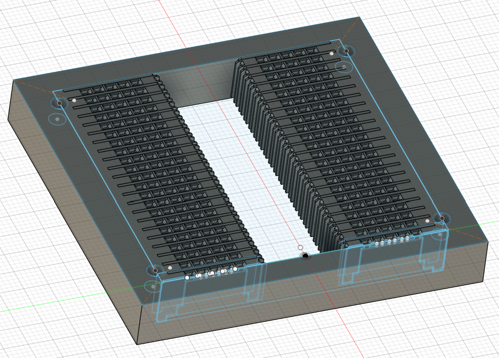
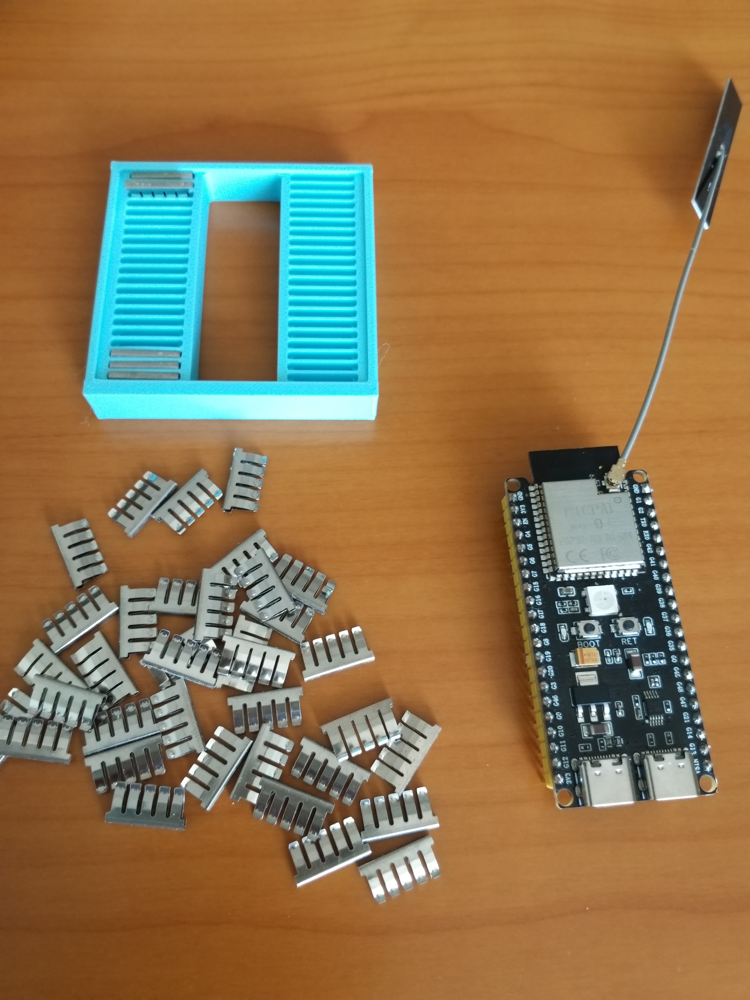
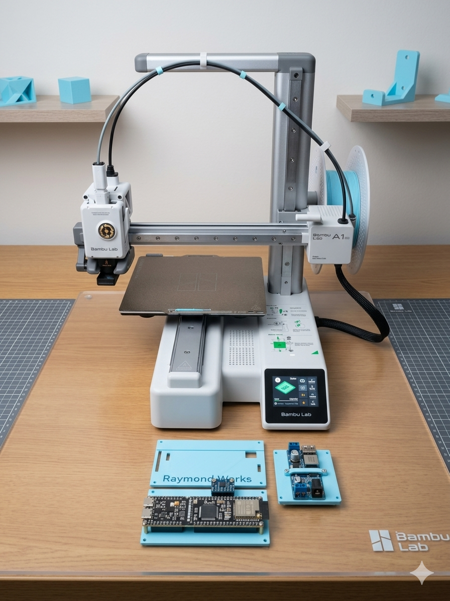

# 🛠️ First Project with Bambu Lab A1 mini: ESP32-S3 + Breadboard CAD Modeling

## 1. Why I Bought the A1 mini
My motivation for purchasing the **Bambu Lab A1 mini** was to work on an autonomous driving car project using a general-purpose development board. I needed a reliable 3D printer to prototype custom mounts and housings, so the A1 mini became my very first printer.

## 2. Why ESP32-S3
I chose the **ESP32-S3** because it supports **micro-ROS**, which is essential for robotics and autonomous systems. However, the board is quite wide, and a single breadboard cannot accommodate it. In fact, I had to use two breadboards side by side just to connect jumper wires properly. This made me realize that a custom mounting solution was necessary.

## 3. CAD Work in Fusion 360
To solve this, I designed a mount in **Fusion 360**:
- Based on the Raspberry Pi footprint (58 x 49 mm), I drilled holes to match the size.  
- Ensured the ESP32-S3 could sit securely while still allowing jumper wire access.  
- Considered future sensor connections, such as the **MPU6050**, so the design would remain expandable.  

## 4. Printing Process
- Sliced the model and printed it on the A1 mini.  
- Experimented with filament settings and print orientation.  
- Captured the printing process and final product for comparison with the CAD design.  

## 5. Reflections
This was my very first 3D printing project, and despite some trial and error, the result was satisfying. Seeing the ESP32-S3 mounted securely on a custom-designed holder gave me a sense of accomplishment.  

Looking ahead, I plan to design cases for sensor modules and even chassis parts for the autonomous car project. This first step has opened the door to many exciting possibilities.
