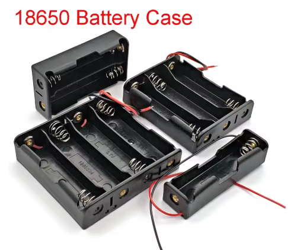
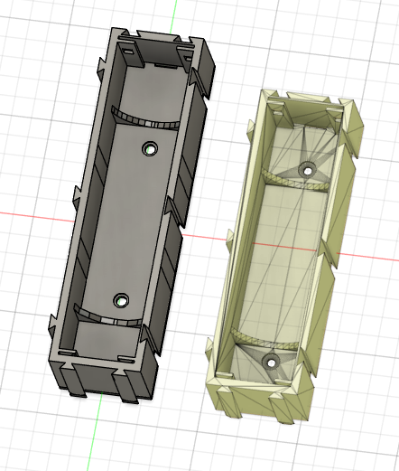
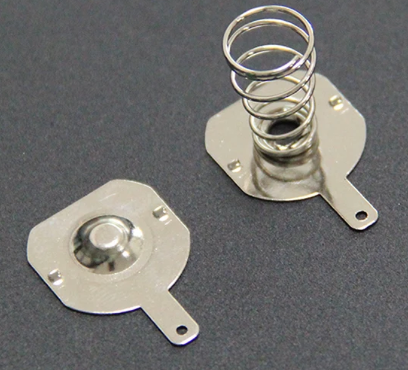
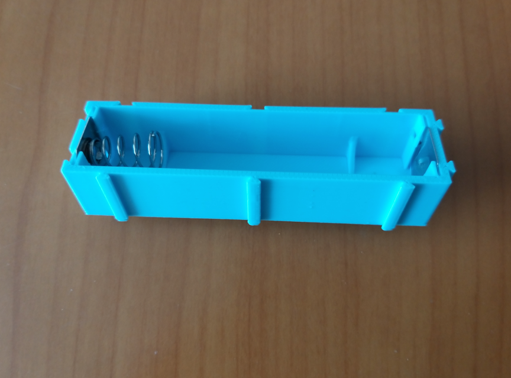

# Custom 18650 Battery Holder for My Autonomous Vehicle Project

When working with 18650 batteries, I realized that **length variations** caused by protection circuits make off-the-shelf holders unreliable. Some batteries fit too tightly, while others are nearly impossible to remove. To solve this, I decided to design and print my own holder.

## Why I Built My Own
- Off-the-shelf holders didn’t match the dimensions of my batteries.
- Inconsistent fit made insertion and removal frustrating.
- I needed a solution tailored to my project’s mounting holes and layout.
- Another critical factor was **wire gauge (AWG)**. Most commercial holders use very thin wires, which are not suitable for higher current applications.  
- I wanted to work with **AWG 20 or thicker** wiring to ensure lower resistance, better durability, and safer operation.

## Design Process
1. **Mesh to Solid Conversion**  
   I imported an STL file into Fusion 360 and converted the mesh into a solid body.  
2. **Length Adjustment**  
   Extended the holder dimensions to accommodate protected 18650 cells.  
3. **Mounting Alignment**  
   Modified the CAD model to match the exact hole spacing of my setup.  
4. **3D Printing**  
   Printed the customized design and tested the fit.

   

## Hardware Choices
- **Metal Clips**: I invested in sturdy, wide clips for reliable electrical contact.  
- **Spring & Dome Contacts**: Used a combination of spring (negative) and dome (positive) terminals for secure connections.  
- **Durability Over Cost**: Even though the clips were slightly more expensive, the improved stability was worth it.

## Assembly & Expansion
The holder includes **interlocking walls** that allow expansion. However, interlocks alone don’t provide strong fixation, so additional reinforcement is necessary:
- Small screws or bolts for rigid attachment.
- Optional brackets or adhesive for added stability.

## Electrical Considerations
- Properly finished bottom wiring with **heat-shrink tubing** for insulation.  
- Use of **bus bars** or thicker copper strips to handle higher current safely.  
- Ensuring consistent contact pressure to withstand vibration.

## Application
This custom holder was designed and mounted for my **autonomous vehicle project**. By tailoring the design, I achieved:
- Secure battery placement.
- Reliable electrical connections.
- A modular system that can expand when needed.

---

Building this holder taught me that sometimes **custom fabrication is the only way** to achieve both precision and reliability. It’s a small but crucial step toward powering my autonomous vehicle safely and efficiently.
