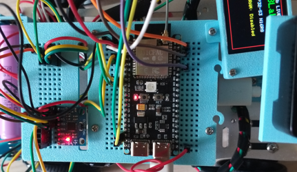
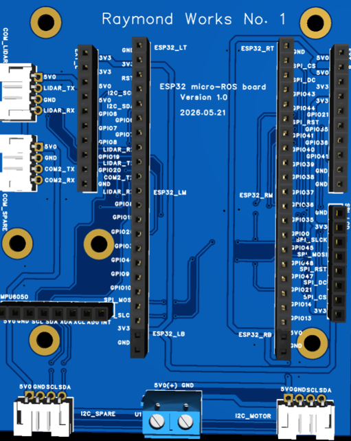
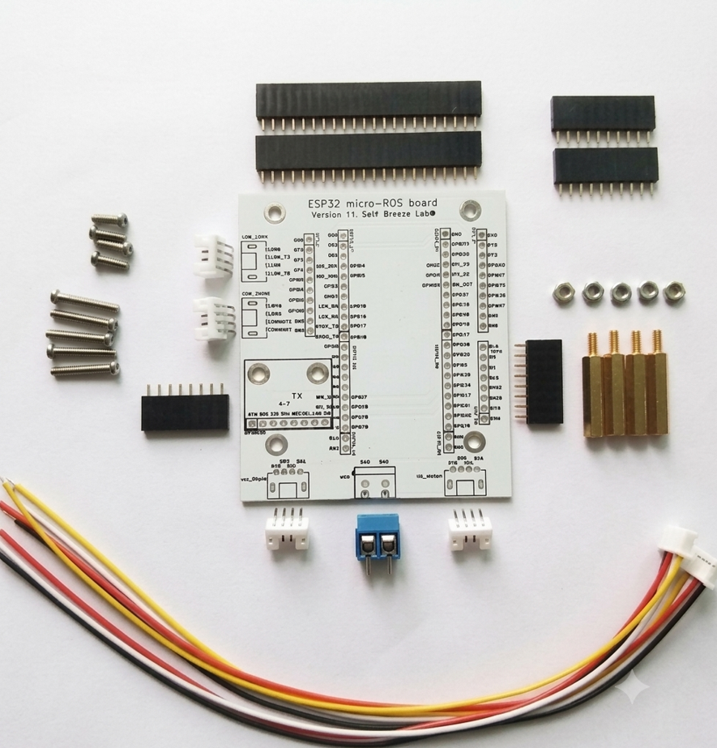
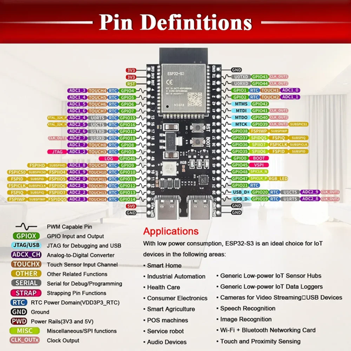
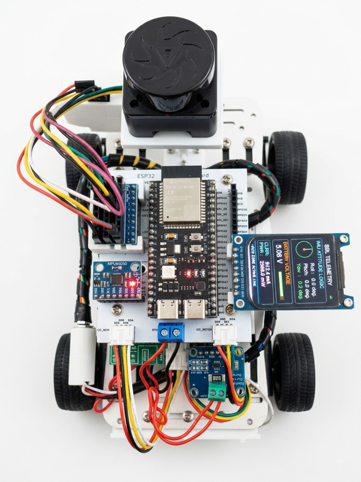

## 1. Motivation: The Sweet Prototyping Days with Breadboards, and the Inevitable Betrayal

In the early stages of robot development, breadboards and jumper wires feel like an absolute blessing. They allow you to quickly hook up an ESP32, an IMU sensor, and motor drivers without touching a soldering iron, tossing them onto a temporary 3D-printed chassis to get a proof of concept (PoC) up and running in no time.

However, this "honeymoon phase" is only valid during the very basic functional verification stage.

### The Beginning of Debugging Hell: 'Minor' Loose Connections
Once you move past the basics and dive into serious software development—flashing micro-ROS-based firmware and implementing robot control or navigation—you inevitably hit a wall, facing a chaotic mess of wires.



_While unavoidable during the initial testing phase, the debugging stress grows exponentially as the number of wires increases._

Even if you design a neat 3D-printed housing to secure everything, the robot's physical movements and vibrations inevitably introduce microscopic **loose connections** that are invisible to the naked eye. This leads to:

* Countless hours wasted rewriting perfectly fine software, unaware that the root cause is purely mechanical hardware.
* Sudden voltage drops or spikes that cause the MCU to reset or specific sensor packets to drop.
* Severe debugging stress that drains your mental energy.

### A Fatal Blow to System Performance (Hz)
In a **ROS2 environment**, where real-time data consistency and predictability are paramount, these loose connections cause issues far worse than a simple complete shutdown.

For instance, when publishing LiDAR scan data, odometry, or IMU metrics, any unstable contact resistance drastically messes with the communication bus. Running the following command to check the topic rate reveals a catastrophic result:

```bash
ros2 topic hz /scan
```

Under normal circumstances, the publishing rate should stay rock-solid at your configured frequency (e.g., 10Hz to 20Hz). However, the moment a loose connection or electrical noise sneaks into the line, the response times fluctuate wildly (Jitter), and severe packet loss drops the Hz significantly. This eventually triggers sensor timeouts in upper-level navigation stacks like Nav2, causing the robot to rotate aimlessly in circles or freeze in place.

"I just want to focus on writing software."
This was the exact moment I realized a dedicated, custom PCB was absolutely essential—one that guarantees rock-solid power delivery and immune-to-vibration communication lines.

## 2. The Solution: Designing Our Dedicated Robot Board, 'Raymond Works No. 1'

To overcome these hardware limitations and fully immerse myself in software development and reliable robot navigation, I finally decided to design a custom integrated PCB. I chose EasyEDA for the task, as it is lightweight, highly accessible, and straightforward for rapid prototyping.

The result is the layout for my very first custom integrated robot controller: Raymond Works No. 1 (Version 1.0).
The messy jungle of jumper wires and breadboards has been consolidated into a single, clean, structured PCB.



Key Design Points & Specifications
Instead of just blindly merging the wires, I strategically planned the component layout based on the pain points discovered during real-world testing:

Direct Sockets for the ESP32-S3 Dev Board (ESP32_LM / RM)

Instead of permanently soldering the MCU or using a breadboard, I placed standard female pin header sockets. This allows the ESP32-S3 development board to be easily plugged in or swapped out like a modular chip, routing all peripheral pins cleanly through internal PCB traces.

Dedicated LiDAR Communication Ports (COM_LIDAR, COM2_SPARE)

To secure reliable data transmission for the LiDAR—the literal eyes of the robot—I replaced the noise-prone jumper wires with dedicated JST-style connector ports. Now, running ros2 topic hz /scan will yield a steady, unfaltering frequency.

Dedicated MPU6050 IMU Sensor Slot

The MPU6050 IMU, which is critical for robot attitude estimation and odometry correction, is assigned a direct socket slot on the bottom left of the board. This completely eliminates I2C bus dropouts caused by chassis vibrations.

Power Infrastructure & I2C Expandability

A robust screw terminal block (5V0(+) GND) is positioned at the bottom center to handle stable power distribution.

Anticipating future upgrades like motor drivers, displays, or additional sensors, I also broke out extra peripheral interfaces like I2C_MOTOR and I2C_SPARE near the bottom.

Wrapping Up the Design Phase
While drawing the schematics, routing the traces one by one, and handling the artwork felt a bit tedious, looking at the finalized 3D view makes it incredibly satisfying.

Compared to the days of stressfully managing a fragile prototype, the peace of mind this single board offers is immense. Now, it's time to export the design data, place the manufacturing order, and prepare for soldering and micro-ROS testing.

## 3. PCB Ordering and Cost: The Ultimate Budget Combo of JLCPCB and Korea Post

Now that the design is complete, it's time to turn it into a physical board. For manufacturing prototyping samples, JLCPCB is by far the most accessible and cost-effective option. Using EasyEDA makes this process incredibly seamless, allowing you to generate and link fabrication files in just a few clicks.

Step 1. Exporting Gerber Files from EasyEDA
To hand over production to the PCB factory, you need 'Gerber files'—the industry-standard data format containing circuit patterns, hole positions, and solder masks.

First, run a Design Rule Check (DRC) from the top menu in EasyEDA to ensure there are no layout errors.

If everything looks good, go to Fabrication ➡️ Gerber Files... to download the production files as a compressed archive (.zip).

Step 2. Uploading to JLCPCB and Getting a Quote
Head over to the JLCPCB website and simply upload the zip file you just downloaded (via the 'Add Gerber File' button). Once the system finishes analyzing the file, it will automatically detect the board dimensions and provide a real-time 3D preview along with an instant quote.

Quantity: 5 pcs (Default minimum)

Layer: 2 Layers (Double-sided PCB)

Cost: Thanks to JLCPCB’s iconic prototype special offer, the base price comes out to a mind-blowing $2.

It never ceases to amaze me that I can get 5 pieces of a custom-designed, proprietary PCB for less than the price of a cup of coffee.

Step 3. Saving on Shipping: Leveraging Korea Post
If you choose express shipping options like DHL or FedEx, the package will arrive in 3 to 4 days, but the shipping fee can easily spike to $15–$20 or more, making the shipping significantly more expensive than the product itself.

If you aren't in a desperate rush, I highly recommend the budget shipping option that integrates with Korea Post (often listed as Global Standard Direct or similar local postal lines).

Shipping Fee: Around $2 (Bringing the grand total to about $4 for 5 custom boards delivered right to your doorstep).

Delivery Time: Roughly 1 to 2 weeks (Including customs clearance and final delivery via the local post office).

"The Wait Time = The Golden Window for Part Sourcing"
While waiting over a week for shipping might feel like a delay, it is by no means wasted time. To ensure you can jump straight into soldering and testing the moment the boards arrive, use this window to source and gather all the necessary core components.

Key Component Bill of Materials (BOM):

Pin header sockets for the ESP32-S3 development board

MPU6050 IMU module

JST connectors and pins for LiDAR communication

Screw terminal blocks for the main power input

Additional connectors for I2C expansion

Ordering these parts from domestic electronics distributors or platforms like AliExpress right after placing the PCB order timed perfectly. The boards and components usually arrive almost simultaneously. In the next post, I'll be back with the physical PCB unboxing, the assembly/soldering process, and the long-awaited initial micro-ROS integration test!

## 4. Sourcing the Components
Honestly, having JLCPCB handle the complete assembly (SMT) for all components was beyond my budget. Furthermore, I couldn't find the exact 44-pin female header footprint (2x22 pins) for the ESP32-S3-WROOM-1 DevKitC-1 in EasyEDA's library. As a workaround, I manually aligned and spaced a combination of 10-pin, 10-pin, and 2-pin headers at standard 2.54mm pitch. Since I planned to source and solder the components separately anyway, this wasn't a major issue.

However, sourcing these individual components turned out to require its own share of trial and error. To save on shipping costs—which could easily exceed the price of the parts themselves—I ended up ordering bulk packs of 100 units rather than just a few pieces. After all, they’ll definitely come in handy for future builds!



The image above shows the second revision of my PCB. This time, I opted for a clean white solder mask and updated the footprint to perfectly match the official pinout of the ESP32-S3-WROOM-1 DevKitC-1.

## 5. Conclusion: The Era of Democratized Hardware Development with AI

For a long time, I used to think that designing and manufacturing custom PCBs was a domain exclusive to professional hardware engineers or tech corporations. However, leveraging intuitive design tools like **EasyEDA** alongside **AI as a co-pilot**, I was able to bridge that gap and bring this board to life without facing any insurmountable hurdles.

Of course, it's worth noting that since my design is built on top of pre-made, budget-friendly development boards rather than routing raw discrete circuit components from scratch, the barrier to entry was significantly lower and much easier to manage. My core objective from the very beginning was simple: **to secure a physically robust, neatly organized, and completely vibration-proof micro-ROS environment.** This was my very first time placing an order through JLCPCB, and to be perfectly honest, I am genuinely amazed that custom hardware manufacturing has become this affordable and accessible to individual makers. 

Looking ahead, I firmly believe that the combination of **3D printing** and **custom PCB fabrication** will drastically elevate both the productivity and the stability of my ongoing DIY robotics projects. 

And of course, I'll be exploring this exciting frontier hand-in-hand with AI.


## 6. New Version

I ended up manufacturing two iterations of the PCB. The first version was designed based on a knockoff ESP32-S3-WROOM-1 DevKitC-1 I had purchased, which actually had 42 pins—though I had laid out 44 pins on the board. After that initial attempt, I acquired an authentic ESP32-S3-WROOM-1 DevKitC-1. 



For this new revision, I chose a white solder mask to match the color of the vehicle chassis. I also enhanced the telemetry display UI and integrated additional components, including an INA219 current/power sensor and an ultrasonic sensor. On the software side, I migrated the build environment from ROS 2 Humble to ROS 2 Jazzy, and ran the micro-ROS agent on Jazzy as well. Below is the final setup.

The main goal of this project was to build a micro-ROS environment using the relatively affordable ESP32-S3-WROOM-1 DevKitC-1—primarily for hands-on learning. While the final build retains a somewhat rugged, unpolished look, the learning experience was invaluable. You'll notice several 3D-printed mounts and standoffs throughout the structure, designed to keep everything level and balanced. The objective was to avoid breadboards as much as possible and create a durable, portable hardware setup. Additionally, the UI was updated, and developing a custom bridge to overcome certain micro-ROS limitations on the ESP32—specifically for lightweight data like battery status and ultrasonic sensor readings—proved to be a particularly meaningful milestone.


