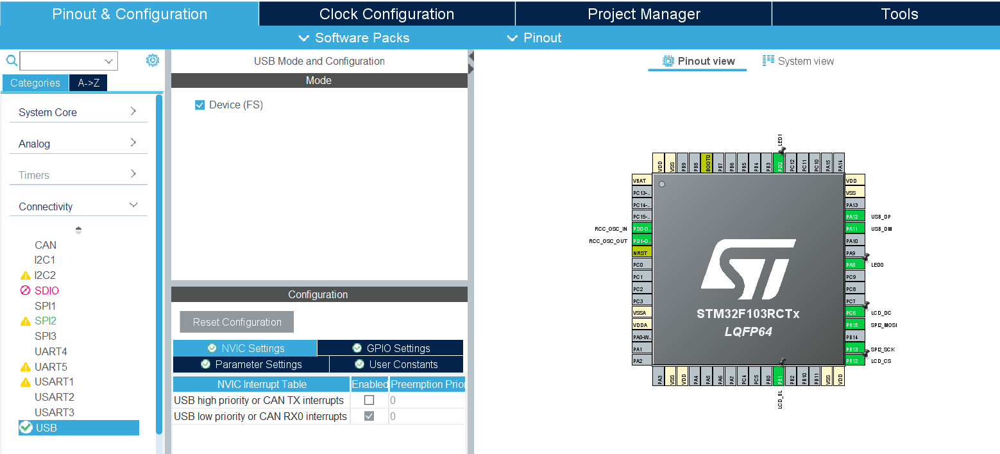
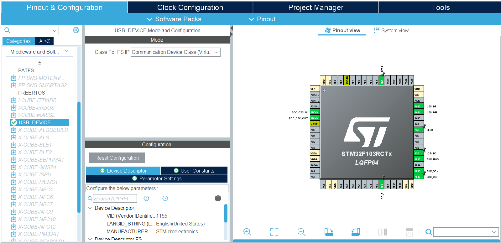
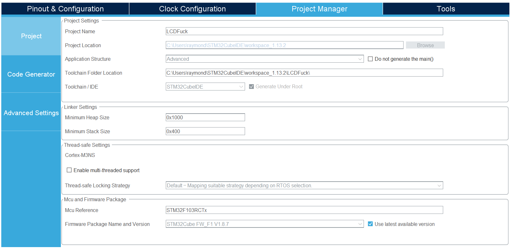
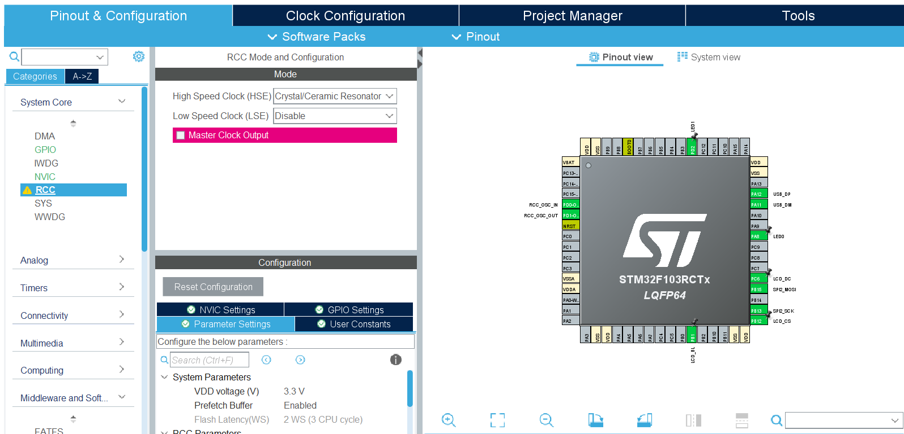
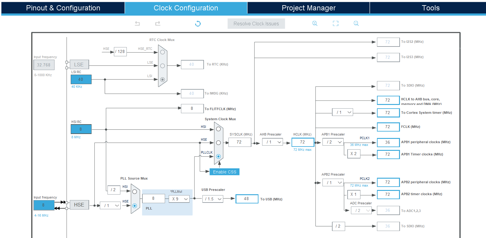

If you are developing with custom or low-cost STM32F103 (e.g., STM32F103RCT6) boards, you might encounter a frustrating Windows 11 error: **"Unknown USB Device (Device Descriptor Request Failed)"** when plugging in the onboard USB cable. 

Even after installing the official STMicroelectronics Virtual COM Port (VCP) drivers, the yellow exclamation mark persists in the Device Manager.

Here is the step-by-step engineering breakdown of why this happens and how to completely fix it via **STM32CubeMX clock tree configuration** and a **clever software-driven hardware reset trick**.

---

## 1. The Root Cause: Fact-Finding & Timing Mismatch

### Hardware Fact: Native USB Architecture
Many custom STM32 boards do not feature a dedicated USB-to-UART bridge chipset (such as CP2102 or CH340). Instead, the USB Mini-B/Type-C data lines ($D-$ and $D+$) are wired **directly** to the MCU's `PA11` and `PA12` pins. This is a **Native USB** implementation where the MCU must emulate a Virtual COM Port (VCP) via firmware.

### The Problem: Fixed Pull-up Resistor Bug
PC hosts detect a Full-Speed USB device connection when the $D+$ line is pulled up to 3.3V. 

Unfortunately, these boards often have a **permanent 1.5kΩ pull-up resistor** hardwired to the $D+$ (`PA12`) line. 
1. The moment you plug in the USB cable, the $D+$ line instantly jumps to 3.3V.
2. The PC immediately sends a `Setup Packet` demanding the device descriptor (*"Who are you?"*).
3. However, the STM32 MCU is still booting up, configuring its system clocks, and has not yet initialized the USB device stack (`MX_USB_DEVICE_Init()`).
4. Since the MCU fails to respond in time, Windows times out and locks the port with a **Device Descriptor Request Failed** error.

---

## 2. STM32CubeMX (.ioc) Core Settings

To unlock the native USB engine, configure your `.ioc` project with the following mandatory parameters:

1. **Connectivity ➡️ USB:** Set Mode to **`Device (FS)`** (This automatically multiplexes `PA11` and `PA12` to USB functions).

2. **Middleware ➡️ USB_DEVICE:** Set Class For FS IP to **`Communication Device Class (Virtual Port Com)`**.

3. **Project Manager ➡️ Linker Settings:** Increase the **`Minimum Heap Size`** to **`0x1000`** (or at least `0x800`). The STM32 USB stack relies heavily on dynamic memory allocation (`malloc`); the default 512-byte heap will cause a silent crash during initialization.


---

## 3. Resolving Clock Tree Discrepancies

The USB controller requires a precise **48MHz** clock to synchronize with the PC. If it deviates by even 1MHz, the USB connection will drop. 


Configure your Clock Configuration tab as follows to achieve a flawless clock architecture without any APB bus violations:

* **RCC Setup:** Set High Speed Clock (HSE) to `Crystal/Ceramic Resonator` (enabling the onboard 8MHz crystal).

* **PLL Source Mux:** Select `HSE`.
* **PLLMul:** Set to `X 9` ➡️ Overclocks the system clock (`SYSCLK`/`HCLK`) to its maximum stable performance of **72MHz**.
* **System Clock Mux:** Select `PLLCLK`.
* **USB Prescaler:** Set to `/ 1.5` ➡️ Divides 72MHz to yield exactly **48MHz** for the USB clock.
* **APB1 Prescaler:** Set to `/ 2` ➡️ Brings the APB1 peripheral clock down to **36MHz** (satisfying the hardware maximum threshold and clearing any GUI refresh bugs).


---

## 4. The Solution: Software-Driven USB Disconnection

To resolve the fixed hardware pull-up timing trap without manually holding down the hardware reset button during plug-in, you can force the PC to re-enumerate the device by simulating a cable detachment programmatically.

Insert the following code snippet inside `main.c` right after `MX_GPIO_Init()` within the **`USER CODE BEGIN 2`** section:

```c
  /* Initialize all configured peripherals */
  MX_GPIO_Init();
  MX_SPI2_Init(); // Your other peripherals
  
  /* USER CODE BEGIN 2 */
  /* -------------------------------------------------------------------------
   * [Native USB Forced Re-Enumeration Hack]
   * Fakes a physical cable disconnection to bypass the hardware pull-up timing bug.
   * ------------------------------------------------------------------------- */
  GPIO_InitTypeDef GPIO_InitStruct = {0};
  
  // 1. Temporarily hijack PA12 (USB_DP) as a standard General-Purpose Output
  GPIO_InitStruct.Pin = GPIO_PIN_12;
  GPIO_InitStruct.Mode = GPIO_MODE_OUTPUT_PP;
  GPIO_InitStruct.Pull = GPIO_NOPULL;
  GPIO_InitStruct.Speed = GPIO_SPEED_FREQ_LOW;
  HAL_GPIO_Init(GPIOA, &GPIO_InitStruct);
  
  // 2. Force PA12 to GND (0V). 
  //    The PC detects the 0V drop and thinks: "The USB cable has been unplugged."
  HAL_GPIO_WritePin(GPIOA, GPIO_PIN_12, GPIO_PIN_RESET);
  
  // 3. Maintain the drop for 500ms to allow the PC OS host to register the disconnect.
  HAL_Delay(500);
  
  // 4. Initialize the official USB Device Stack.
  //    Inside this function, ST's HAL restores PA12 back to its 'Alternate Function USB' mode.
  //    The line springs back to 3.3V via the hardware pull-up resistor.
  //    The PC thinks a new device was just plugged into a fully booted, ready-to-respond MCU!
  MX_USB_DEVICE_Init(); 
  /* ------------------------------------------------------------------------- */
  
  // Your Application Initializations (e.g., Display, Sensors)
  ST7735_Init();
  /* USER CODE END 2 */
  ```
## 5. The Result
Compile and flash the firmware using your ST-Link debugger. Once loaded, the MCU will automatically trigger a 500ms connection delay upon any hardware reset or power cycle.

Windows 11 will immediately discard the corrupted state, re-enumerate the device interface, and cleanly assign a functioning STMicroelectronics Virtual COM Port (COMx).

By implementing this native VCP pipeline, you bypass external translation chipsets entirely, achieving a raw 12Mbps bandwidth that lets your FreeRTOS kernels stream multi-sensor data or display telemetry data seamlessly over a single USB cable!
