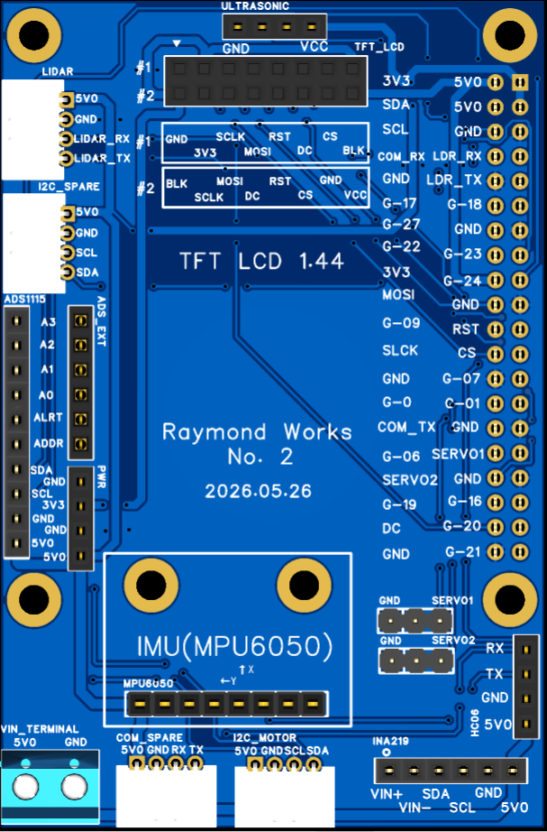
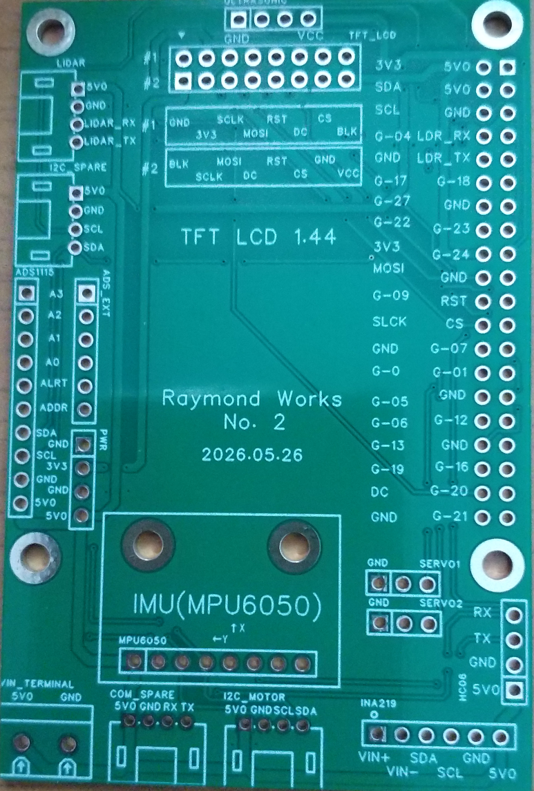
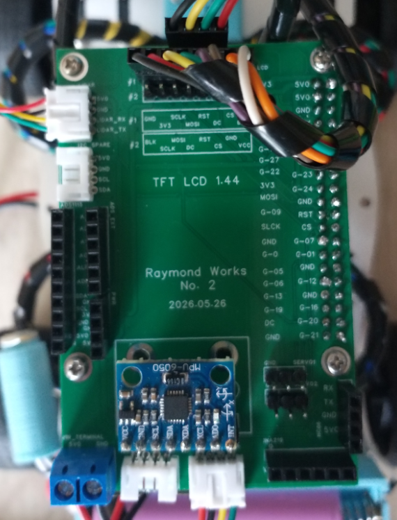
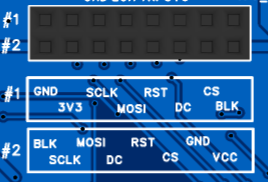
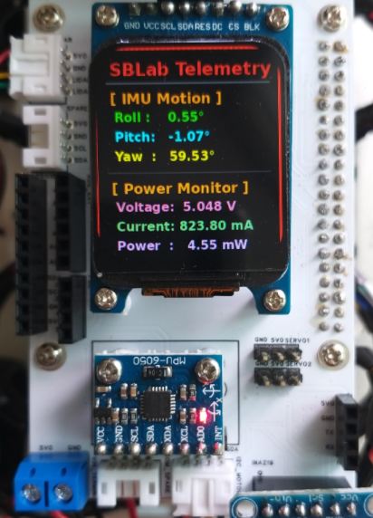

## Introduction: Shifting from ESP32 to Raspberry Pi
Recently, I designed a micro-ROS PCB based on the ESP32. Around the same time, I also developed one for the Raspberry Pi. The ESP32-based project didn’t use the Arduino IDE; instead, it relied on the Ubuntu-based ESP-IDF environment. Since the language itself is C/C++, navigating that setup felt a bit clunky and ambiguous. That’s why I decided to create a Raspberry Pi HAT (Hardware Attached on Top).

## The Limitations of ESP32 in micro-ROS

Due to memory and hardware constraints, the ESP32 had a clear limitation in micro-ROS, capping out at 3 Publishers and 3 Subscribers. If you want to build an autonomous driving system with this setup, essential components like the IMU (magnetometer), Lidar, and Odometry are absolute must-haves—leaving no room to publish data from any additional sensors. On top of that, you need a micro-ROS agent running on a higher-level system (like a Raspberry Pi) to handle deserialization.

## The Advantages of Using Raspberry Pi

The Raspberry Pi, however, changes the game. You can code easily in Python, and since it doesn't need a separate micro-ROS agent, it allows you to maximize your Publish/Subscribe nodes within the available memory and CPU overhead. 

## Hardware Features & Pin Layout of the HAT

While the focus was on autonomous driving, I designed this HAT to fully utilize and expand the Raspberry Pi’s 40-pin GPIO. I packed it with various features, including:
* **INA219:** Voltage/current sensor
* **ADS1115:** ADC
* **HC-06:** Bluetooth module
* **HC-04:** Ultrasonic sensor
* **Dual Servo Connections**
* **8-pin SPI Port:** For directly plugging in a 1.44" TFT LCD

For the 1.44" TFT LCD (SPI), I accommodated the two most common pin configurations used by different manufacturers. The board was also designed to support the increasingly popular 1.69" IPS LCD modules using the same SPI interface.

While both displays work perfectly fine for robotics projects, the 1.69" IPS LCD quickly became my personal favorite thanks to its higher resolution and significantly better image quality. Once you try it, it is surprisingly difficult to go back to the smaller 1.44" display.

I also exposed extra I2C ports, an I2C port for the motor board, a serial port for the Lidar sensor, and an additional spare serial/Bluetooth port.

## Manufacturing and Assembly with JLCPCB

Approximately ten days after placing the order, the PCB arrived from JLCPCB. Once the PCBs arrived, I gathered all of the required components separately and prepared everything for assembly, as shown in the image below.

The photo shows the complete set of parts for the Raspberry Pi HAT project, including header pins, PH2.0 connectors, mounting hardware, and cables. At this stage, nothing had been soldered yet—it was the final preparation step before assembly began.

After soldering the connectors and headers, the board was ready for integration with the Raspberry Pi and the rest of the robotics platform.

## Testing with ROS2 Humble and AI

Even though I haven't attached all the sensors yet, I ran tests on the Raspberry Pi using various nodes based on ROS2 Humble alongside some AI implementations. Everything worked flawlessly. Working with Python boosted my productivity significantly, and having AI generate the foundational boilerplate code made the process incredibly smooth.

## Connector Standardization (PH2.0)

The connections to the Lidar were standardized using PH2.0 connectors, which I crimped myself for a clean, direct fit. The I2C connection to the motor board also uses a PH2.0 socket. This standardization makes it seamless to swap between this board and the ESP32-based one.

## Power Management Considerations for Servos

The board includes two servo connectors for applications such as camera gimbals, pan-tilt mechanisms, or various sensor experiments.

For small hobby servos like the SG90, the onboard connectors are perfectly adequate for testing and experimentation. However, I highly recommend installing the optional INA219 module and keeping an eye on the current consumption in real time—especially during startup or sudden direction changes, where current spikes can be surprisingly large.

For anything larger than an SG90-class servo, an external power supply should be considered mandatory rather than optional. Drawing high servo currents directly from the Raspberry Pi power rail is simply asking for instability sooner or later.

One advantage of including the INA219 footprint on the board is that it enables not only hardware monitoring but also software protection strategies. For example, if the measured current exceeds a predefined threshold, the software can automatically stop the servo or disable certain functions before something resets or overheats.

That may sound slightly over-engineered for a hobby project, but that's exactly the kind of experimentation that makes DIY robotics fun. Watching current consumption in real time and teaching the robot how to protect itself is just as interesting as making the motors move in the first place.

## Display Installation

Since the Raspberry Pi HAT itself is roughly the same size as the Raspberry Pi board, mounting a large LCD directly onto the HAT was never a realistic option.

Instead, I designed the board to support two compact and popular display options commonly used in robotics projects: the 1.44" TFT LCD and the 1.69" IPS LCD.

The display headers were designed so that the LCD module can be plugged directly into the board using vertical header pins without requiring any additional cables or adapters. To maximize compatibility, the PCB supports the two most common 8-pin SPI pin layouts found on commercially available LCD modules, allowing users to select whichever version they happen to have.

The final setup can be seen below using the 1.69" IPS LCD module.

Rather than fixing the display permanently to the PCB, I chose to support it horizontally above the board using a small 3D-printed bracket. This approach keeps the display easy to replace while maintaining a clean overall appearance for the robot platform.

## The Philosophy of DIY Prototyping vs. Ready-Made Kits

At the end of the day, the biggest advantage of a Raspberry Pi HAT is being able to fully leverage the 40-pin layout while effortlessly coding with the help of AI. Ready-made Raspberry Pi kits have their merits, but I believe in taking a step-by-step, hands-on approach. You can only learn so much from a pre-assembled commercial product.

To be fair, calling this a "HAT" might be an overstatement since it’s quite barebones and lacks complex circuit components. I don’t claim to have that level of electrical engineering expertise, nor did I want to overcomplicate it. You can find plenty of feature-rich boards on AliExpress if that's what you need. 

For me, the software is what truly matters. For people utilizing a platform like the Raspberry Pi (or the Jetson Nano, for that matter), buying a fully finished product defeats the purpose of the hobby. My sole objective was to free myself from messy wiring and loose connections so I could focus entirely on software development.

## Cost Analysis and Version 2 Planning

**Conclusion:** With a quick design session in EasyEDA and a 10-day shipping window, manufacturing this PCB cost roughly 5,300 KRW (under $4 USD)—less than two cups of Starbucks coffee. I will definitely keep using JLCPCB, and I’m already working on V2 of this Raspberry Pi HAT. Seeing the physical board in hand immediately highlighted areas for improvement.

Ultimately, the main goal of this kind of PCB work is to prototype something originally built on a breadboard. The greatest benefits are eliminating loose jumper wires, avoiding connection frustration, and establishing a standardized layout to reuse core components.

## Overcoming the JST Connector Headache

During this journey, dealing with JST sockets and cables (SH, XH, PH, etc.) was honestly a massive headache because the varieties are endless. I settled on PH2.0 simply because my encoder motors used an 8-pin PH2.0 socket, which prompted me to buy a crimping tool kit for custom lengths. I’m glad to see that investment finally paying off.

## Final Thoughts

I truly believe anyone can do this if they set their mind to it. The real question is: *What do you want to build?*