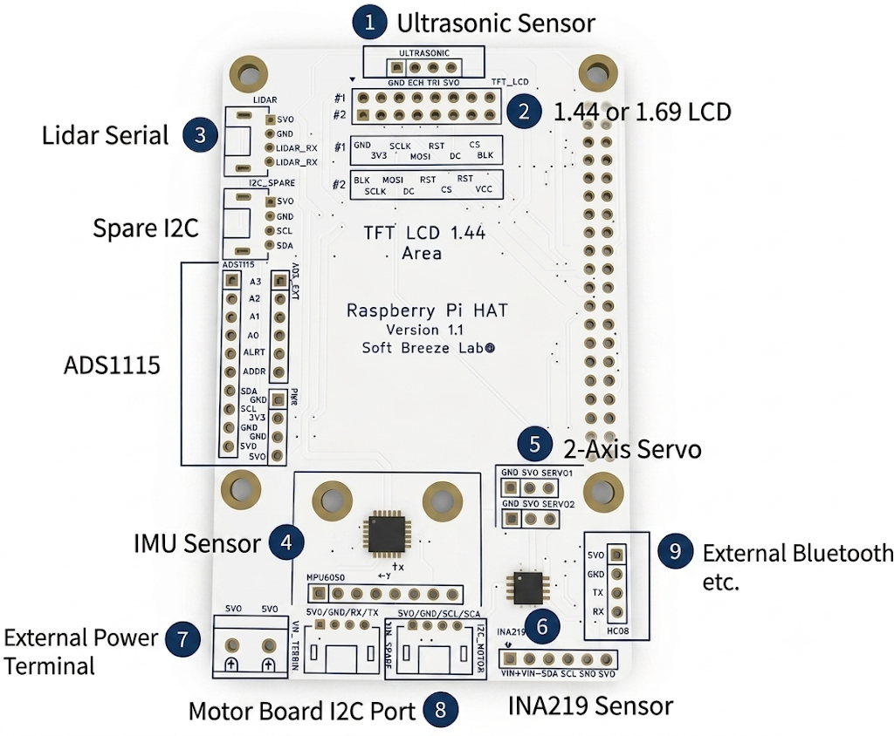
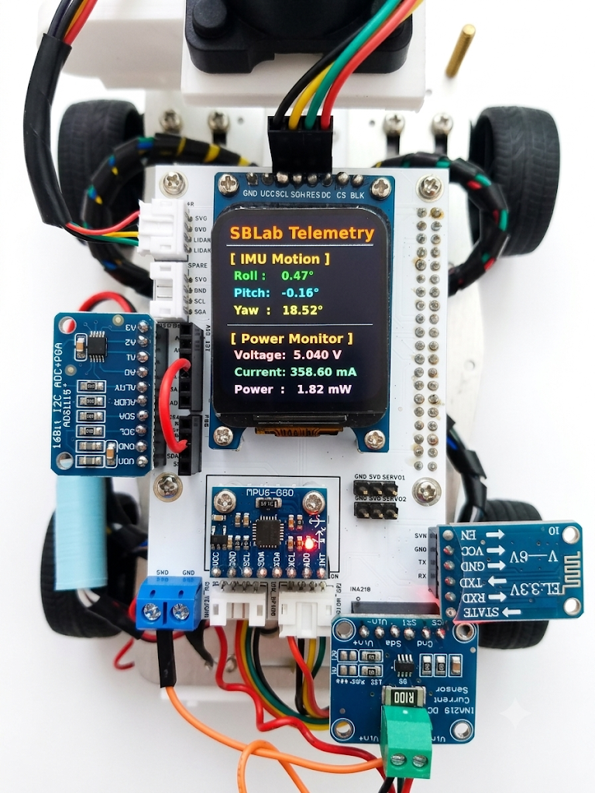

## Introduction
During the development of my Raspberry Pi based autonomous robot platform,
I found that most commercially available robot HATs consumed nearly all of the
Raspberry Pi 40-pin GPIO header.

This significantly reduced expandability and made it difficult to add additional
sensors, communication modules, or custom hardware later.

My goal was simple:

> Create a Raspberry Pi Robot HAT that provides all commonly required robotics interfaces while preserving as much of the original 40-pin GPIO header as possible.

The result is the **Soft Breeze Lab Raspberry Pi Robot HAT Version 1.1**.

---

## Design Philosophy



The design goals were:

- Preserve access to the Raspberry Pi 40-pin GPIO header.
- Minimize external wiring.
- Provide dedicated interfaces for commonly used robotics modules.
- Support educational and experimental robotics projects.
- Allow future expansion without redesigning the hardware.

Unlike many robotics HATs, this board is intended to be a **development platform**
rather than a fixed-purpose controller board.

---

## Hardware Features
### 1. Ultrasonic Sensor Connector

A dedicated connector is provided for ultrasonic distance sensors such as:

- HC-SR04
- JSN-SR04T
- Other trigger/echo compatible modules

Connector signals:

- GND
- ECHO
- TRIG
- 5V

```python
import time
import os

# Define GPIO pin numbers (based on BCM naming convention)
TRIG = "23"
ECHO = "24"

# Export a GPIO pin to make it accessible in the user space
def export_gpio(pin):
    if not os.path.exists(f"/sys/class/gpio/gpio{pin}"):
        try:
            with open("/sys/class/gpio/export", "w") as f:
                f.write(pin)
            time.sleep(0.1) # Give the OS a brief moment to create the virtual files
        except PermissionError:
            print("[Error] Permission denied. Please run this script with sudo.")
            exit()

# Configure the pin direction ('in' or 'out')
def set_direction(pin, direction):
    with open(f"/sys/class/gpio/gpio{pin}/direction", "w") as f:
        f.write(direction)

# Write HIGH(1) or LOW(0) to an output pin
def set_value(pin, value):
    with open(f"/sys/class/gpio/gpio{pin}/value", "w") as f:
        f.write(str(value))

# Read the digital value of an input pin (returns 0 or 1)
def get_value(pin):
    with open(f"/sys/class/gpio/gpio{pin}/value", "r") as f:
        return int(f.read().strip())

# 1. Initialize hardware interfaces and directions
export_gpio(TRIG)
export_gpio(ECHO)
set_direction(TRIG, "out")
set_direction(ECHO, "in")

print(f"Starting Ultrasonic Sensor Sysfs Test (TRIG: GPIO {TRIG}, ECHO: GPIO {ECHO})")
print("Press Ctrl+C to stop the test.\n")

try:
    while True:
        # 2. Trigger the ultrasonic burst by pulling the TRIG pin HIGH for 10us
        set_value(TRIG, 0)
        time.sleep(0.00005) # Stabilize the signal
        set_value(TRIG, 1)
        time.sleep(0.00001) # Hold HIGH for exactly 10 microseconds
        set_value(TRIG, 0)

        # 3. Wait until the ECHO pin goes HIGH(1) and log the pulse start time
        start_time = time.time()
        timeout = start_time
        while get_value(ECHO) == 0:
            start_time = time.time()
            if start_time - timeout > 0.05: # Timout safety check if there is no response for 50ms
                break

        # 4. Wait until the ECHO pin goes back to LOW(0) and log the pulse end time
        stop_time = time.time()
        while get_value(ECHO) == 1:
            stop_time = time.time()

        # 5. Calculate elapsed time and translate it into distance
        duration = stop_time - start_time
        distance = (duration * 34300) / 2 # Speed of sound (343m/s) divided by 2 (round-trip)

        if 0.0 < distance < 400.0:
            print(f"Measured Distance: {distance:.2f} cm")
        else:
            print("Measurement Error or Out of Range")

        time.sleep(0.5) # Wait 0.5 seconds before the next measurement

except KeyboardInterrupt:
    print("\nTest terminated.")
finally:
    # 6. Clean up used resources (Unexport the pins)
    print("Releasing GPIO resources...")
    try:
        if os.path.exists(f"/sys/class/gpio/gpio{TRIG}"):
            with open("/sys/class/gpio/unexport", "w") as f: f.write(TRIG)
        if os.path.exists(f"/sys/class/gpio/gpio{ECHO}"):
            with open("/sys/class/gpio/unexport", "w") as f: f.write(ECHO)
    except:
        pass
    print("Cleanup completed.")

```

---

### 2. TFT LCD Support

The HAT supports two popular SPI TFT displays:

- 1.44" TFT LCD (ST7735)
- 1.69" IPS LCD (ST7789)

Because different manufacturers use different pin arrangements,
two common pin configurations are supported directly on the PCB.

Typical applications:

- Robot telemetry
- Battery monitoring
- IMU orientation display
- Sensor diagnostics

```python
#!/usr/bin/env python3
import rclpy
from rclpy.node import Node
from sensor_msgs.msg import Imu

import time
import math
import spidev
import RPi.GPIO as GPIO
import board
import busio
from adafruit_ina219 import INA219
from PIL import Image, ImageDraw, ImageFont

class ImuPowerDisplayNode(Node):
    def __init__(self):
        super().__init__('imu_power_display_node')

        # 1. ROS 2 subscription setup for MPU6050 IMU topic
        self.subscription = self.create_subscription(
            Imu,
            '/imu/data',
            self.imu_callback,
            10
        )

        # 2. Initialize INA219 power monitoring sensor via I2C
        try:
            # Use Raspberry Pi's default I2C pins (SDA, SCL)
            self.i2c = busio.I2C(board.SCL, board.SDA)
            self.ina219 = INA219(self.i2c)
            self.get_logger().info("Successfully connected to INA219 sensor via I2C.")
        except Exception as e:
            self.get_logger().error(f"Failed to initialize INA219 sensor: {e}")
            self.ina219 = None

        # 3. Hardware static pin mapping (LCD SPI configuration)
        self.CS_PIN = 8
        self.DC_PIN = 26
        self.RST_PIN = 25

        GPIO.setwarnings(False)
        GPIO.setmode(GPIO.BCM)
        GPIO.setup(self.CS_PIN, GPIO.OUT)
        GPIO.setup(self.DC_PIN, GPIO.OUT)
        GPIO.setup(self.RST_PIN, GPIO.OUT)

        # 4. Open SPI communication and optimize clock speed
        # Note: ST7735 is generally stable at 16MHz~24MHz; attempting 24MHz here.
        self.spi = spidev.SpiDev()
        self.spi.open(0, 0)
        self.spi.max_speed_hz = 24000000  # Set to 24MHz for optimal ST7735 stability
        self.spi.mode = 0

        # 5. Hardware reset sequence for LCD
        GPIO.output(self.RST_PIN, GPIO.HIGH)
        time.sleep(0.1)
        GPIO.output(self.RST_PIN, GPIO.LOW)
        time.sleep(0.1)
        GPIO.output(self.RST_PIN, GPIO.HIGH)
        time.sleep(0.2)

        # Screen resolution and offset settings for the 1.44-inch ST7735 display (128x128)
        self.lcd_width = 128
        self.lcd_height = 128
        self.X_OFFSET = 2  # Default panel hardware offset
        self.Y_OFFSET = 3

        # 6. Initialize ST7735 registers via direct command sequence
        self.lcd_init_commands()

        # 7. Setup system fonts (scaled down to fit the 128x128 resolution)
        try:
            self.font_title = ImageFont.truetype("/usr/share/fonts/truetype/dejavu/DejaVuSans-Bold.ttf", 11)
            self.font_sub_title = ImageFont.truetype("/usr/share/fonts/truetype/dejavu/DejaVuSans-Bold.ttf", 9)
            self.font_data = ImageFont.truetype("/usr/share/fonts/truetype/dejavu/DejaVuSans-Bold.ttf", 9)
        except IOError:
            self.font_title = ImageFont.load_default()
            self.font_sub_title = ImageFont.load_default()
            self.font_data = ImageFont.load_default()

        # Initialize local storage variables for IMU orientations
        self.roll = 0.0
        self.pitch = 0.0
        self.yaw = 0.0

        # Initialize local storage variables for INA219 metrics
        self.load_voltage = 0.0
        self.current = 0.0
        self.power = 0.0

        # Run display refresh timer at 0.5-second intervals
        self.timer_period = 0.5
        self.timer = self.create_timer(self.timer_period, self.timer_callback)
        self.get_logger().info("SBLab Integrated IMU & Power Display Node (ST7735 1.44\") started successfully.")

    def command(self, c):
        GPIO.output(self.CS_PIN, GPIO.LOW)
        GPIO.output(self.DC_PIN, GPIO.LOW)
        self.spi.xfer2([c])
        GPIO.output(self.CS_PIN, GPIO.HIGH)

    def data(self, d):
        GPIO.output(self.CS_PIN, GPIO.LOW)
        GPIO.output(self.DC_PIN, GPIO.HIGH)
        self.spi.xfer2(d)
        GPIO.output(self.CS_PIN, GPIO.HIGH)

    def lcd_init_commands(self):
        self.command(0x01) # SWRESET: Software reset command
        time.sleep(0.15)
        self.command(0x11) # SLPOUT: Exit sleep mode
        time.sleep(0.12)

        # ST7735 Frame Rate Control (frequency configuration)
        self.command(0xB1)
        self.data([0x01, 0x2C, 0x2D])
        self.command(0xB2)
        self.data([0x01, 0x2C, 0x2D])
        self.command(0xB3)
        self.data([0x01, 0x2C, 0x2D, 0x01, 0x2C, 0x2D])

        # ST7735 Power Control Setup
        self.command(0xC0)
        self.data([0xA2, 0x02, 0x84])
        self.command(0xC1)
        self.data([0xC5])
        self.command(0xC2)
        self.data([0x0A, 0x00])
        self.command(0xC3)
        self.data([0x8A, 0xEE])
        self.command(0xC4)
        self.data([0x8A, 0xEE])

        # VCOM Control Setup
        self.command(0xC5)
        self.data([0x0E])

        self.command(0x3A) # COLMOD: Define pixel format (16-bit RGB565)
        self.data([0x05])

        self.command(0x36) # MADCTL: Memory Access Control (screen orientation layout)
        self.data([0xC8]) # Standard default for 1.44" upside-down screen correction (adjust if needed)

        # Gamma Correction Configuration
        self.command(0xE0)
        self.data([0x02, 0x1c, 0x07, 0x12, 0x37, 0x32, 0x29, 0x2d, 0x29, 0x25, 0x2B, 0x39, 0x00, 0x01, 0x03, 0x10])
        self.command(0xE1)
        self.data([0x03, 0x1d, 0x07, 0x06, 0x2E, 0x2C, 0x29, 0x2D, 0x2E, 0x2E, 0x37, 0x3F, 0x00, 0x00, 0x02, 0x10])

        self.command(0x20) # INVOFF: Disable display inversion (change to 0x21 if rendering negatives)
        self.command(0x29) # DISPON: Turn on display
        time.sleep(0.1)

    def set_window(self, x0, y0, x1, y1):
        x0_corrected = x0 + self.X_OFFSET
        x1_corrected = x1 + self.X_OFFSET
        y0_corrected = y0 + self.Y_OFFSET
        y1_corrected = y1 + self.Y_OFFSET

        self.command(0x2A) # CASET: Column Address Set
        self.data([x0_corrected >> 8, x0_corrected & 0xFF, x1_corrected >> 8, x1_corrected & 0xFF])
        self.command(0x2B) # RASET: Row Address Set
        self.data([y0_corrected >> 8, y0_corrected & 0xFF, y1_corrected >> 8, y1_corrected & 0xFF])
        self.command(0x2C) # RAMWR: Start writing pixels to graphics memory

    def send_large_data(self, data_list):
        GPIO.output(self.CS_PIN, GPIO.LOW)
        GPIO.output(self.DC_PIN, GPIO.HIGH)
        chunk_size = 4000
        for i in range(0, len(data_list), chunk_size):
            self.spi.xfer2(data_list[i:i+chunk_size])
        GPIO.output(self.CS_PIN, GPIO.HIGH)

    def imu_callback(self, msg):
        q = msg.orientation

        # Convert quaternion representation to Euler angles (Roll, Pitch, Yaw)
        sinr_cosp = 2 * (q.w * q.x + q.y * q.z)
        cosr_cosp = 1 - 2 * (q.x * q.x + q.y * q.y)
        self.roll = math.atan2(sinr_cosp, cosr_cosp)

        sinp = 2 * (q.w * q.y - q.z * q.x)
        if abs(sinp) >= 1:
            self.pitch = math.copysign(math.pi / 2, sinp)
        else:
            self.pitch = math.asin(sinp)

        siny_cosp = 2 * (q.w * q.z + q.x * q.y)
        cosy_cosp = 1 - 2 * (q.y * q.y + q.z * q.z)
        self.yaw = math.atan2(siny_cosp, cosy_cosp)

        # Translate radians to readable degrees
        self.roll = math.degrees(self.roll)
        self.pitch = math.degrees(self.pitch)
        self.yaw = math.degrees(self.yaw)

    def timer_callback(self):
        # 1. Fetch INA219 power metrics (only executed if the device is registered)
        if self.ina219 is not None:
            try:
                bus_voltage = self.ina219.bus_voltage
                shunt_voltage = self.ina219.shunt_voltage
                self.load_voltage = bus_voltage + (shunt_voltage / 1000)
                self.current = self.ina219.current
                self.power = self.ina219.power
            except Exception as e:
                self.get_logger().warn(f"Failed to read from INA219: {e}")

        # 2. Render virtual canvas frame (128x128 pixels)
        image = Image.new("RGB", (self.lcd_width, self.lcd_height), (0, 0, 0))
        draw = ImageDraw.Draw(image)

        # Draw outer bounding box border
        draw.rectangle((0, 0, self.lcd_width-1, self.lcd_height-1), outline=(255, 0, 0), width=1)

        # Draw main title header (scaled to fit within 128px width)
        draw.text((8, 6), "SBLab Telemetry", font=self.font_title, fill=(255, 0, 0))
        draw.line([(6, 20), (self.lcd_width-6, 20)], fill=(100, 100, 100), width=1)

        # --- SECTION 1: IMU MOTION DATA ---
        draw.text((8, 24), "[ IMU Motion ]", font=self.font_sub_title, fill=(255, 165, 0))
        draw.text((12, 36),  f"R : {self.roll:6.1f}°", font=self.font_data, fill=(0, 255, 0))
        draw.text((12, 48), f"P : {self.pitch:6.1f}°", font=self.font_data, fill=(0, 255, 255))
        draw.text((12, 60), f"Y : {self.yaw:6.1f}°", font=self.font_data, fill=(255, 255, 0))

        # Central divider line
        draw.line([(6, 73), (self.lcd_width-6, 73)], fill=(60, 60, 60), width=1)

        # --- SECTION 2: POWER MONITOR DATA (INA219) ---
        draw.text((8, 77), "[ Power Monitor ]", font=self.font_sub_title, fill=(255, 165, 0))
        draw.text((12, 89),  f"V : {self.load_voltage:5.2f} V", font=self.font_data, fill=(255, 105, 180))
        draw.text((12, 101), f"C : {self.current:5.1f} mA", font=self.font_data, fill=(144, 238, 144))
        draw.text((12, 113), f"P : {self.power:5.1f} mW", font=self.font_data, fill=(238, 130, 238))

        # 3. Extract RGB channels and convert to 16-bit RGB565 byte representation
        pixel_bytes = []
        pixels = image.load()
        for y in range(self.lcd_height):
            for x in range(self.lcd_width):
                r, g, b = pixels[x, y]
                rgb565 = ((r & 0xF8) << 8) | ((g & 0xFC) << 3) | (b >> 3)
                pixel_bytes.append((rgb565 >> 8) & 0xFF)
                pixel_bytes.append(rgb565 & 0xFF)

        # 4. Set corrected viewport windows and transmit binary image stream
        self.set_window(0, 0, self.lcd_width - 1, self.lcd_height - 1)
        self.send_large_data(pixel_bytes)

def main(args=None):
    rclpy.init(args=args)
    node = ImuPowerDisplayNode()
    try:
        rclpy.spin(node)
    except KeyboardInterrupt:
        node.get_logger().info("SBLab system shutting down.")
    finally:
        node.spi.close()
        GPIO.cleanup()
        node.destroy_node()
        rclpy.try_shutdown()

if __name__ == '__main__':
    main()
```


---

### 3. Dedicated UART for Lidar

A dedicated serial interface is reserved for Lidar modules.

Examples include:

- YDLIDAR T-mini Plus
- Other UART based 2D Lidars

Connector signals:

- 5V
- GND
- RX
- TX

```bash
/usr/bin/python3 /opt/ros/humble/bin/ros2 launch ydlidar_ros2_driver ydlidar_launch.py
```
---

### 4. MPU6050 IMU Support

The board includes a dedicated footprint for the MPU6050 IMU module.

Features include:

- 3-axis accelerometer
- 3-axis gyroscope
- Orientation estimation

Applications include:

- Roll calculation
- Pitch calculation
- Motion analysis
- Robot stabilization

```python
#!/usr/bin/env python3

import rclpy
from rclpy.node import Node
from sensor_msgs.msg import Imu
from geometry_msgs.msg import Quaternion
import smbus2
import math


class Mpu6050Publisher(Node):

    def __init__(self):
        super().__init__('mpu6050_publisher')

        # ROS2 IMU publisher
        self.publisher_ = self.create_publisher(Imu, '/imu/data', 10)

        # MPU6050 Register Definitions
        self.DEVICE_ADDRESS = 0x68
        self.PWR_MGMT_1 = 0x6B
        self.ACCEL_XOUT_H = 0x3B
        self.GYRO_XOUT_H = 0x43

        try:
            # Open I2C bus 1
            self.bus = smbus2.SMBus(1)

            # Initialize MPU6050
            self.init_mpu()

            self.get_logger().info(
                "MPU6050 initialized successfully."
            )

        except Exception as e:
            self.get_logger().error(
                f"Failed to initialize MPU6050: {e}"
            )
            return

        # Complementary filter variables
        self.roll = 0.0
        self.pitch = 0.0
        self.yaw = 0.0

        # Complementary filter coefficient
        self.alpha = 0.96

        self.last_time = self.get_clock().now()

        # Optimized from 100Hz to 40Hz to reduce CPU load
        # on Raspberry Pi 4.
        self.timer_period = 0.025
        self.timer = self.create_timer(
            self.timer_period,
            self.timer_callback
        )

    def init_mpu(self):
        """Wake up MPU6050 from sleep mode."""
        self.bus.write_byte_data(
            self.DEVICE_ADDRESS,
            self.PWR_MGMT_1,
            0
        )

    def read_raw_data(self, addr):
        """Read signed 16-bit data from MPU6050 register."""

        high = self.bus.read_byte_data(
            self.DEVICE_ADDRESS,
            addr
        )

        low = self.bus.read_byte_data(
            self.DEVICE_ADDRESS,
            addr + 1
        )

        value = (high << 8) | low

        if value > 32768:
            value -= 65536

        return value

    def euler_to_quaternion(self, roll, pitch, yaw):
        """Convert Euler angles to quaternion."""

        r = math.radians(roll)
        p = math.radians(pitch)
        y = math.radians(yaw)

        cy = math.cos(y * 0.5)
        sy = math.sin(y * 0.5)

        cp = math.cos(p * 0.5)
        sp = math.sin(p * 0.5)

        cr = math.cos(r * 0.5)
        sr = math.sin(r * 0.5)

        q = Quaternion()

        q.w = cr * cp * cy + sr * sp * sy
        q.x = sr * cp * cy - cr * sp * sy
        q.y = cr * sp * cy + sr * cp * sy
        q.z = cr * cp * sy - sr * sp * cy

        return q

    def timer_callback(self):

        try:
            # Read accelerometer data
            acc_x = self.read_raw_data(
                self.ACCEL_XOUT_H
            )
            acc_y = self.read_raw_data(
                self.ACCEL_XOUT_H + 2
            )
            acc_z = self.read_raw_data(
                self.ACCEL_XOUT_H + 4
            )

            # Read gyroscope data
            gyro_x = self.read_raw_data(
                self.GYRO_XOUT_H
            )
            gyro_y = self.read_raw_data(
                self.GYRO_XOUT_H + 2
            )
            gyro_z = self.read_raw_data(
                self.GYRO_XOUT_H + 4
            )

            # Calculate elapsed time
            current_time = self.get_clock().now()

            dt = (
                current_time - self.last_time
            ).nanoseconds / 1e9

            self.last_time = current_time

            if dt <= 0:
                dt = self.timer_period

            # Calculate roll and pitch from accelerometer
            acc_roll = math.atan2(
                acc_y,
                acc_z
            ) * 180 / math.pi

            acc_pitch = math.atan2(
                -acc_x,
                math.sqrt(
                    acc_y ** 2 +
                    acc_z ** 2
                )
            ) * 180 / math.pi

            # Convert gyroscope values to deg/sec
            gyro_roll_vel = gyro_x / 131.0
            gyro_pitch_vel = gyro_y / 131.0
            gyro_yaw_vel = gyro_z / 131.0

            # Complementary filter
            self.roll = (
                self.alpha *
                (
                    self.roll +
                    gyro_roll_vel * dt
                )
                +
                (1 - self.alpha) *
                acc_roll
            )

            self.pitch = (
                self.alpha *
                (
                    self.pitch +
                    gyro_pitch_vel * dt
                )
                +
                (1 - self.alpha) *
                acc_pitch
            )

            # Yaw is estimated only from gyroscope data
            self.yaw += gyro_yaw_vel * dt

            # Create ROS2 IMU message
            imu_msg = Imu()

            imu_msg.header.stamp = (
                current_time.to_msg()
            )

            # Use a dedicated IMU frame for TF tree integration
            imu_msg.header.frame_id = 'imu_link'

            # Orientation
            imu_msg.orientation = (
                self.euler_to_quaternion(
                    self.roll,
                    self.pitch,
                    self.yaw
                )
            )

            # Angular velocity (rad/sec)
            imu_msg.angular_velocity.x = math.radians(
                gyro_roll_vel
            )
            imu_msg.angular_velocity.y = math.radians(
                gyro_pitch_vel
            )
            imu_msg.angular_velocity.z = math.radians(
                gyro_yaw_vel
            )

            # Linear acceleration (m/s²)
            imu_msg.linear_acceleration.x = (
                acc_x / 16384.0
            ) * 9.80665

            imu_msg.linear_acceleration.y = (
                acc_y / 16384.0
            ) * 9.80665

            imu_msg.linear_acceleration.z = (
                acc_z / 16384.0
            ) * 9.80665

            # Publish ROS2 IMU message
            self.publisher_.publish(
                imu_msg
            )

        except Exception as e:
            self.get_logger().warning(
                f"Error while reading or publishing IMU data: {e}"
            )


def main(args=None):

    rclpy.init(args=args)

    node = Mpu6050Publisher()

    try:
        rclpy.spin(node)

    except KeyboardInterrupt:
        node.get_logger().info(
            "MPU6050 node stopped."
        )

    finally:
        node.destroy_node()
        rclpy.shutdown()


if __name__ == '__main__':
    main()
```

---

### 5. Dual Servo Outputs

Two servo outputs are provided.

Each connector exposes:

- GND
- 5V
- PWM Signal

Applications include:

- Pan/Tilt camera systems
- Sensor positioning
- Small robotic arms

```python
from gpiozero import Servo
from time import sleep

# ------------------------------------------------------------
# Configure two servo motors connected to Raspberry Pi GPIO
#
# Servo 1 -> GPIO12
# Servo 2 -> GPIO13
#
# A wider pulse width range (0.5ms ~ 2.5ms) is specified to
# support most standard hobby servo motors.
# ------------------------------------------------------------
servo1 = Servo(
    12,
    min_pulse_width=0.5 / 1000,
    max_pulse_width=2.5 / 1000
)

servo2 = Servo(
    13,
    min_pulse_width=0.5 / 1000,
    max_pulse_width=2.5 / 1000
)

try:
    print("Starting servo motor test (Press Ctrl+C to stop)")

    while True:

        # Move both servos to the minimum position
        # (-1 corresponds to the minimum angle)
        print("Servo Position: MIN")
        servo1.min()
        servo2.min()
        sleep(1)

        # Move both servos to the center position
        # (0 corresponds to the center angle)
        print("Servo Position: CENTER")
        servo1.mid()
        servo2.mid()
        sleep(1)

        # Move both servos to the maximum position
        # (1 corresponds to the maximum angle)
        print("Servo Position: MAX")
        servo1.max()
        servo2.max()
        sleep(1)

except KeyboardInterrupt:
    # Safely stop PWM output before exiting
    print("\nStopping servos and exiting...")

    servo1.detach()
    servo2.detach()
```

---

### 6. INA219 Power Monitor

A dedicated INA219 connector enables real-time monitoring of:

- Battery voltage
- Current consumption
- System power usage

Example telemetry:

```text
Voltage : 12.31 V
Current : 840 mA
Power   : 10.34 W
```

```python
import time
import board
import busio
from adafruit_ina219 import INA219

# ------------------------------------------------------------
# Initialize the I2C bus using the Raspberry Pi default pins
# SDA -> GPIO2
# SCL -> GPIO3
# ------------------------------------------------------------
i2c = busio.I2C(board.SCL, board.SDA)

# ------------------------------------------------------------
# Initialize the INA219 current and power monitor.
#
# The default I2C address is 0x40.
# If the address has been changed using the address jumpers,
# it can be specified as:
#
# ina219 = INA219(i2c, address=0x41)
# ------------------------------------------------------------
ina219 = INA219(i2c)

print("Starting INA219 monitoring (Press Ctrl+C to stop)")
print("-" * 50)

try:
    while True:

        # Bus voltage measured at the load side (Volts)
        bus_voltage = ina219.bus_voltage

        # Voltage drop across the shunt resistor (mV)
        shunt_voltage = ina219.shunt_voltage

        # Current consumption (mA)
        current = ina219.current

        # Power consumption (mW)
        power = ina219.power

        # Calculate the actual load voltage
        # Load Voltage = Bus Voltage + Shunt Voltage
        load_voltage = bus_voltage + (shunt_voltage / 1000)

        # Display results
        print(f"Load Voltage : {load_voltage:.3f} V")
        print(f"Bus Voltage  : {bus_voltage:.3f} V")
        print(f"Shunt Voltage: {shunt_voltage:.3f} mV")
        print(f"Current      : {current:.2f} mA")
        print(f"Power        : {power:.2f} mW")
        print("-" * 50)

        time.sleep(2)

except KeyboardInterrupt:
    print("\nMeasurement stopped.")
```

---

### 7. External Power Terminal

An external screw terminal is included for battery input.

Advantages include:

- Secure wiring
- Easy maintenance
- Support for higher current loads

---

### 8. Motor Controller Interface

Dedicated communication ports are available for motor controller boards(Yahboom).

Supported interfaces:

- UART
- I2C

---

### 9. Additional UART Port

An additional UART connector is available for:

- HC-05 / HC-06 Bluetooth modules
- GPS receivers
- ESP8266 modules
- Custom serial peripherals

---

### 10. ADS1115 Analog Input Expansion

Since Raspberry Pi does not include native analog inputs,
the HAT integrates an ADS1115 16-bit ADC module.

The following signals are internally connected:

- VCC
- GND
- SDA
- SCL

The following signals are exposed for external access:

- ADDR
- ALERT
- A0
- A1
- A2
- A3

This effectively turns the ADS1115 into an integrated analog subsystem.

Typical applications include:

- Battery monitoring
- Analog joysticks
- Potentiometers
- Light sensors
- Custom analog sensors

```python
# A0 <-> RPI 3V3, for Simple 3V3 monitoring. because VCC - 5V0, So no problem.
import time
import board
import busio
import adafruit_ads1x15.ads1115 as ADS
from adafruit_ads1x15.analog_in import AnalogIn

i2c = busio.I2C(board.SCL, board.SDA)

ads = ADS.ADS1115(i2c, address=0x48)

chan = AnalogIn(ads, 0)   # A0 채널

while True:
    print(f"RAW={chan.value:6d}  Voltage={chan.voltage:.4f} V")
    time.sleep(1)

```

---

## Preserving the Raspberry Pi GPIO Header

This was the primary design objective.

Many robotics HATs occupy almost all GPIO pins,
making future expansion difficult.

This design intentionally preserves access to most of the original
Raspberry Pi 40-pin GPIO header.

Benefits include:

- Additional sensors
- Experimental interfaces
- Future upgrades
- User customization

The HAT should assist development, not restrict it.

---

## Validation and Testing



The following components have been successfully verified:

- TFT LCD
- MPU6050
- ADS1115
- INA219
- Lidar UART Interface
- Motor Controller Interface
- Additional UART Port

The final validation step was the ADS1115 subsystem.

The device was detected successfully:

```text
0x48
```

A simple test was performed by connecting:

```text
3.3V -> A0
```

Measured result:

```text
3.2985 V
```

This confirmed:

- PCB routing
- I2C communication
- Power integrity
- ADC functionality

---


## Conclusion

The Soft Breeze Lab Raspberry Pi Robot HAT v1.1 is not intended to be just another robotics shield.

Instead, it is designed as a flexible robotics development platform that balances:

- Integration
- Expandability
- Ease of use
- GPIO accessibility

Most importantly, it allows developers to continue using the Raspberry Pi as a Raspberry Pi,
rather than hiding it behind a restrictive HAT.

With the successful ADS1115 verification, the hardware validation of Version 1.1 is now complete.

---

## Future Improvements

Possible future enhancements include:

- Battery divider circuitry
- RTC support
- CAN Bus interface
- RS485 interface
- Additional sensor connectors
- Integrated power management

---

## Hardware Summary

| Feature | Status |
|----------|--------|
| TFT LCD | Verified |
| MPU6050 | Verified |
| ADS1115 | Verified |
| INA219 | Verified |
| Lidar UART | Verified |
| Motor Interface | Verified |
| Extra UART | Verified |
| GPIO Accessibility | Preserved |
| Hardware Validation | Complete |

---

## Reflections

After feeling stuck and frustrated for a few months, I finally decided to dive into DIY. Even for a simple project like this, there was so much to learn, and honestly, I wouldn’t have even been able to start without AI.

It all began as a little hobby to make use of an old Raspberry Pi I had lying around the house. But as I bumped into various component issues and mechanical challenges, I ended up learning CAD design, mastering EasyEDA, and even getting custom PCBs made through JLCPCB.

Now that it’s finished, it might look like nothing special, has very few features, and seems pretty humble. But the whole process has given me a whole new level of respect for the everyday devices we all use.

---