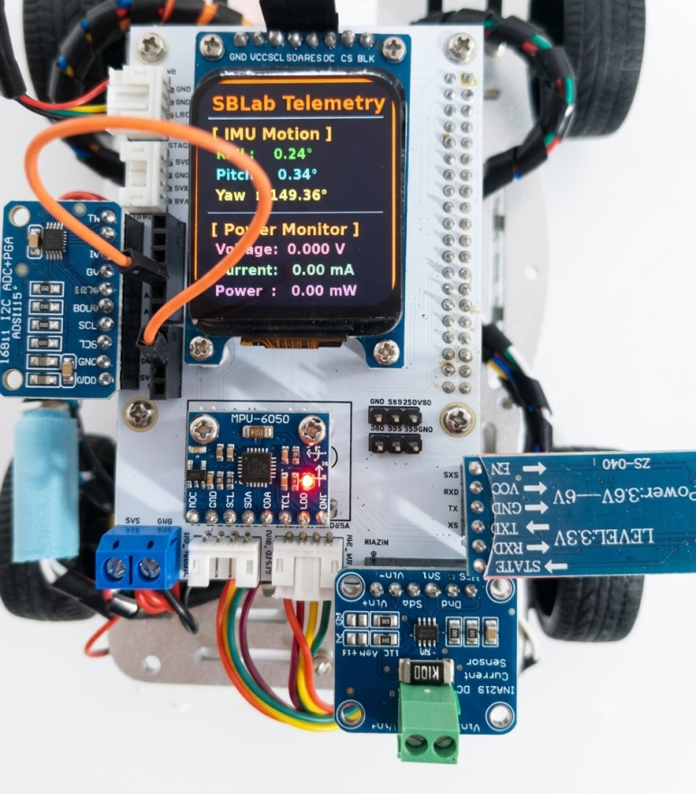

## Introduction
During the development of my Raspberry Pi based autonomous robot platform, I found that most commercially available robot HATs had one major limitation: they consumed almost all of the Raspberry Pi 40-pin GPIO header.

This significantly reduced expandability and made it difficult to add additional sensors, communication modules, or custom hardware later.

My goal was simple:

Create a Raspberry Pi Robot HAT that provides all commonly required robotics interfaces while preserving as much of the original 40-pin GPIO header as possible.

The result is the Soft Breeze Lab Raspberry Pi Robot HAT Version 1.1.

## Design Philosophy

The design goals were:

Preserve access to the Raspberry Pi 40-pin GPIO header.
Minimize external wiring.
Provide dedicated interfaces for commonly used robotics modules.
Support both educational and experimental robotics projects.
Allow future expansion without redesigning the hardware.

Unlike many robotics HATs, this board is intended to be a development platform, not a fixed-purpose controller board.

## Hardware Features
1. Ultrasonic Sensor Connector

A dedicated connector is provided for ultrasonic distance sensors such as:

HC-SR04
JSN-SR04T
Other compatible trigger/echo based modules

The connector exposes:

GND
ECHO
TRIG
5V

This allows quick installation without using jumper wires.

2. TFT LCD Support

The HAT supports two popular SPI TFT display modules:

1.44" TFT LCD (ST7735)
1.69" IPS LCD (ST7789)

Since different manufacturers use different pin arrangements, two common pin layouts are supported directly on the PCB.

The display can be used for:

Robot telemetry
Sensor information
Battery monitoring
IMU orientation display
Debug information
3. Dedicated UART for Lidar

A dedicated serial interface is reserved for Lidar modules.

Supported examples include:

YDLIDAR T-mini Plus
MS200
Other UART based 2D Lidars

Connector signals:

5V
GND
RX
TX

This prevents conflicts with other communication devices.

4. MPU6050 IMU Support

The board includes a dedicated footprint for the MPU6050 IMU module.

The IMU provides:

Accelerometer
Gyroscope
Orientation estimation

Typical applications include:

Roll calculation
Pitch calculation
Yaw estimation
Motion analysis

5. Dual Servo Connectors

Two servo outputs are available.

Each connector provides:

GND
5V
PWM signal

Typical uses include:

Pan/Tilt camera systems
Robotic arms
Sensor positioning mechanisms
6. INA219 Power Monitor

A dedicated INA219 current sensor connector is included.

This allows real-time monitoring of:

Battery voltage
Motor current
System power consumption

Example telemetry:

Voltage : 12.31 V
Current : 840 mA
Power   : 10.34 W

This feature is extremely useful for mobile robots.

7. External Power Terminal

An external screw terminal is included for battery input.

Advantages include:

Secure connection
Easy maintenance
Support for higher current applications

8. Motor Controller Interfaces

The HAT provides dedicated communication ports for the motor controller board.

Supported interfaces include:

UART
I2C

This design allows flexibility depending on the motor board implementation.

9. Additional UART Port

An additional UART connector is available for:

HC-05/HC-06 Bluetooth modules
ESP8266 WiFi modules
GPS receivers
Custom serial peripherals

10. ADS1115 Analog Input Expansion

Raspberry Pi does not provide native analog inputs.

To solve this limitation, the HAT integrates an ADS1115 16-bit ADC module.

The board internally connects:

VCC
GND
SDA
SCL

while exposing the following signals externally:

ADDR
ALERT
A0
A1
A2
A3

This effectively turns the ADS1115 into a built-in analog subsystem for the robot platform.

Typical applications include:

Battery voltage monitoring
Analog joysticks
Potentiometers
Light sensors
Custom analog sensors

## Preserving the Raspberry Pi GPIO Header

This was the most important design goal.

Many robotics HATs occupy nearly the entire GPIO header, leaving little room for future expansion.

This design intentionally preserves access to most of the Raspberry Pi GPIO pins.

Benefits include:

Additional sensors
Custom interfaces
Experimental hardware
Future upgrades

The HAT should assist development, not restrict it.

## Validation and Testing

All onboard interfaces have been verified on actual hardware.

Tested Components
TFT LCD display
MPU6050 IMU
ADS1115 ADC
INA219 Power Monitor
Lidar UART interface
Motor board communication interface
Additional UART port

The final hardware verification step was the ADS1115 subsystem.

The module was detected successfully:

0x48

A simple test was performed by connecting:

3.3V -> A0

The measured result was:

3.2985 V

This confirmed:

PCB routing
I2C communication
Power integrity
ADC functionality
## Example Telemetry Screen

The TFT display can show:

IMU orientation
Battery voltage
Current consumption
Power usage

This allows quick diagnostics without connecting a monitor or SSH session.

## Conclusion

The Soft Breeze Lab Raspberry Pi Robot HAT v1.1 is not intended to be another generic robotics shield.

Instead, it is designed as a flexible robotics development platform that balances:

Integration
Expandability
Ease of use
GPIO accessibility

Most importantly, it allows developers to continue using the Raspberry Pi as a Raspberry Pi, rather than hiding it behind a restrictive HAT.

After completing the final ADS1115 verification test, the hardware validation phase of Version 1.1 is now complete.

## Future Improvements

Potential future additions include:

Native battery divider circuitry
Optional RTC support
CAN Bus interface
RS485 interface
Additional sensor headers
Integrated power management
Hardware Summary
Feature	Status
TFT LCD	Verified
MPU6050	Verified
ADS1115	Verified
INA219	Verified
Lidar UART	Verified
Motor Board Interface	Verified
Extra UART	Verified
GPIO Accessibility	Preserved
Hardware Validation	Complete