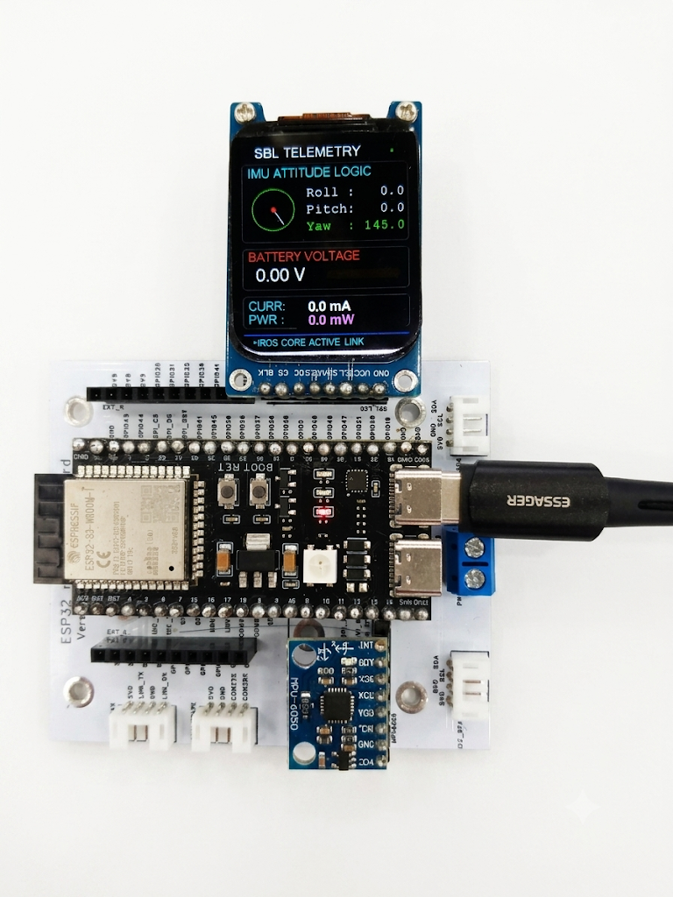

## Overview
I used a 1.69-inch IPS Display (ST7789) as a telemetry UI. On Raspberry Pi, font and text size were not a major issue. However, when using it in the ESP-IDF environment with the Adafruit-GFX-Library, the default fonts and sizes became problematic.

## Generating Fonts with Adafruit-GFX-Library

Looking into the Adafruit-GFX-Library directory, you’ll find the following structure. The folder of interest here is **fontconvert**.

```bash
go@ubuntu2404:~/esp/projects/atlas_new_esp/components/Adafruit-GFX-Library$ tree -L 2
.
├── Adafruit_GFX.cpp
├── Adafruit_GFX.h
├── Adafruit_GrayOLED.cpp
├── Adafruit_GrayOLED.h
├── Adafruit_SPITFT.cpp
├── Adafruit_SPITFT.h
├── Adafruit_SPITFT_Macros.h
├── CMakeLists.txt
├── component.mk
├── examples
│   ├── GFXcanvas
│   └── mock_ili9341
├── fontconvert
│   ├── bdf2adafruit.py
│   ├── DejaVuSans6pt7b.h
│   ├── DejaVuSans8pt7b.h
│   ├── fontconvert
│   ├── fontconvert.c
│   ├── fontconvert_win.md
│   ├── Makefile
│   └── makefonts.sh
├── Fonts
│   ├── DejaVuSans6pt7b.h
│   ├── DejaVuSans8pt7b.h
│   ├── FreeMono12pt7b.h
│   ├── FreeMono18pt7b.h
│   ├── FreeMono24pt7b.h
...<omission>...
```


### Build (fontconvert)
By running the following command, the fontconvert executable is generated:

```bash
go@ubuntu2404:~/esp/projects/atlas_new_esp/components/Adafruit-GFX-Library/fontconvert$ 
make
```

## Using fontconvert
### On Ubuntu 24.04 LTS
Since the ESP-IDF environment was set up on Ubuntu 24.04 LTS, we can use system fonts to generate new ones. As an example, I used the commonly available DejaVuSans.ttf to create a 6pt font.

```bash
go@ubuntu2404:~/esp/projects/atlas_new_esp/components/Adafruit-GFX-Library/fontconvert$ 
./fontconvert /usr/share/fonts/truetype/dejavu/DejaVuSans.ttf 6 > ../Fonts/DejaVuSans6pt7b.h
```

### Practical Usage

After declaring the font, simply load it with tft.setFont(..). It’s straightforward:

```cpp
#include <Fonts/DejaVuSans8pt7b.h>
#include <Fonts/DejaVuSans6pt7b.h>
..

void display()
{

   ...<omission>...
   tft.setFont(&DejaVuSans6pt7b);
   tft.setTextSize(1);
   ...<omission>...
}
```

## Conclusion
The default fonts max out at 9pt, which is not suitable for a 1.69-inch (280x240) display. Additionally, the default font style was not visually appealing. Therefore, generating custom fonts is an important consideration when working with this setup.

