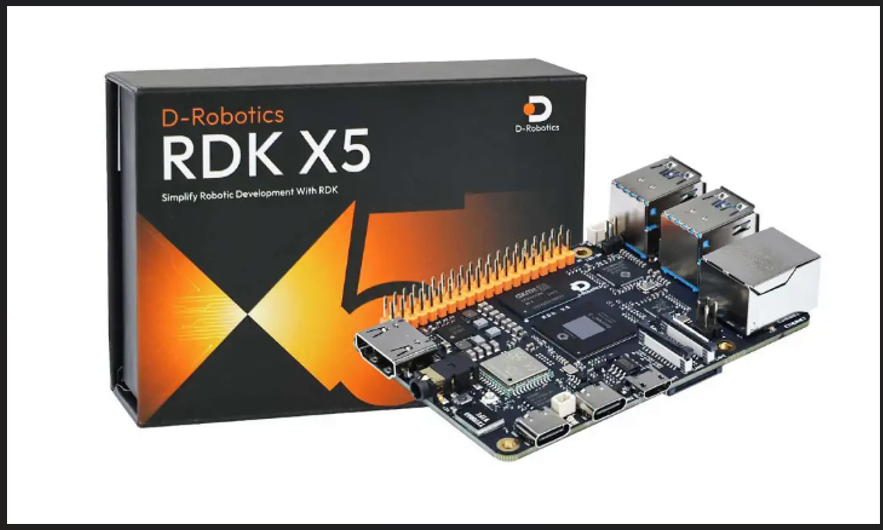
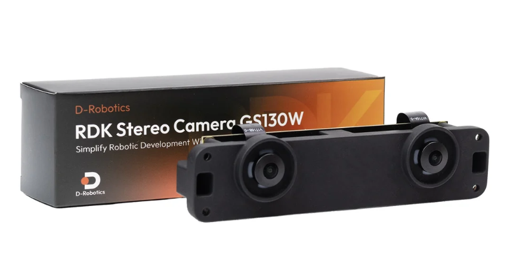
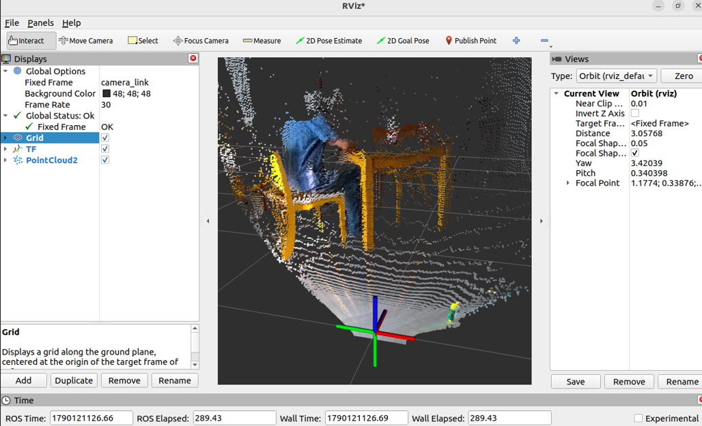
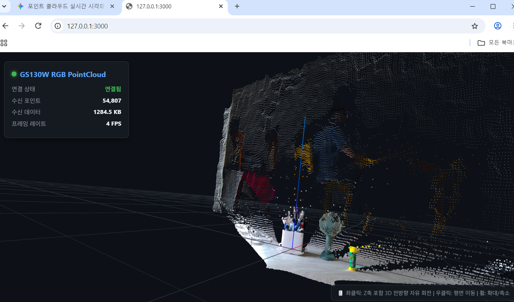

## Motivation for Purchase

I had been using a custom-built HAT on my Raspberry Pi 4B (4GB) for autonomous driving vehicles, and it served me well over time. LiDAR-based SLAM worked without major issues, providing hardware and kinematic stability.

However, Depth Cameras were simply too expensive. Furthermore, processing depth data within the constrained 4GB RAM environment of the Raspberry Pi 4B felt inadequate. While I did have some regrets about the RAM capacity when I first bought the Pi 4B, it handled LiDAR-based SLAM reasonably well.

On the other hand, executing AI workloads like YOLO object detection on the Raspberry Pi 4B was slow and ill-suited due to CPU performance limits. While I managed to run it on an old laptop with an NVIDIA GTX 1050 by streaming the screen via MediaMTX, it is undeniably impractical and inconvenient for autonomous vehicle integration.

Then, I stumbled upon the RDK X5. Manufactured in China, it offered great cost performance and came equipped with a BPU (Brain Processing Unit). Intrigued, I checked YouTube to see what people were building with it.

A Raspberry Pi 5B is expensive, and adding an AI HAT incurs additional cost. Moving up to the NVIDIA Jetson Orin series was way out of budget—a completely different tier. On top of that, standard Depth Cameras remained prohibitively pricey.

I figured the best bang-for-the-buck setup to gain hands-on experience with AI and Depth Cameras on a budget would be the RDK X5 8GB paired with the GS130W Stereo Camera. However, likely due to the recent spike in RAM prices, the RDK X5 board price had doubled.

While browsing secondhand marketplaces, I luckily found an affordable listing that included a heatsink case. Upon delivery, it turned out to be in near-mint condition. That prompted me to immediately purchase the GS130W stereo camera and get started. Had I not found that used RDK X5 8GB, I probably wouldn't have started this project at all, as I could not justify the cost against the uncertain expected satisfaction for a personal hobby.

## RDK X5

I've been using Raspberry Pi SBCs for about 8 years—initially for IoT projects, and later for building custom ROS2 autonomous driving PCBs. For basic LiDAR-based SLAM, 4GB RAM felt sufficient. Still, I always wished for 8GB RAM and more CPU cores, but the Raspberry Pi 5 was simply too expensive.

Here are my initial testing impressions of the delivered RDK X5 (note: these reflect my personal experience and may not be universal):

- **8 Cores ARM Cortex-A55 @ 1.5 GHz, 8 GB RAM**: You really need this much memory to comfortably run various tests. 4GB is definitely a bottleneck.
- **BPU 10 TOPS**: Unlike the Raspberry Pi 5B, the built-in BPU allows you to experiment with AI capabilities at a very reasonable cost.
- **40-Pin Header Compatibility**: Crucial for me, as it allowed direct mounting of my custom Raspberry Pi HAT.
- **CAN Bus Support**: Needed for CAN communication with an ESP32.
- **IPEX Antenna Connector**: Previously, I had to plug an external USB Wi-Fi dongle with an antenna into the Raspberry Pi. That's no longer necessary.
- **ROS2 TROS Humble OS Image**: Ships with a validated ROS2 OS image, drastically reducing setup time.
- **Abundant Examples & Documentation**: Provided by D-Robotics.

Most importantly, I verified that my custom Raspberry Pi 40-pin HAT (originally built for LiDAR SLAM) worked directly, with only one extra serial port becoming unavailable. Aside from swapping the standard RPi GPIO driver for Hobot, peripherals like SPI, I2C, Serial, and Servo control worked out of the box. This meant minimal software modifications were required.

After thorough testing, I feel the RDK X5 running ROS2 TROS Humble is a very solid development board.

## GS130W

The GS130W is a stereo camera designed specifically for D-Robotics' RDK series. It cannot function without the BPU, and all camera streams are published as ROS2 topics. This means no standard `/dev/video*` devices are created in the system.

My testing results with the RDK X5 + GS130W setup are summarized below:

- **RDK Exclusive**: The GS130W only works with the RDK series. Be aware that standard video devices like `/dev/video*` are not created.
- **ROS2 Topic-Based**: Video frames and data are published via ROS2 topics. Without a basic understanding of ROS2, it can be inconvenient to use. However, integrating it with AI pipelines is straightforward.
- **Requires BPU**: It cannot operate without the BPU because real-time depth calculation from stereo frames relies on it. Standard depth cameras perform these calculations on their internal dedicated hardware instead.
- **NV12 Output Format**: The raw stream outputs in NV12 format at over 30 fps. However, converting this to RGB cuts the frame rate roughly in half down to 10–15 fps.
- **YOLO & StereoNet Integration**: When running YOLO alongside StereoNet, using an 8-bit quantized model yields around 10–15 fps. Note that you MUST use a model optimized for the NV12 format to maintain this speed. Standard YOLO models cause heavy latency and lag, as both YOLO and StereoNet compete for BPU resources.
- **Visual SLAM Limitations**: Running heavy visual SLAM frameworks like RTAB-Map is practically unfeasible. For example, publishing raw Point Clouds at 14 fps consumes nearly 350 Mbps of Wi-Fi bandwidth when visualized remotely via RViz2. Due to wireless overhead, this causes severe network bottlenecks.
- **Wired Connection Required**: I was only able to view TF, map, and Point Cloud data in RTAB-Map smoothly over a wired Ethernet connection.
- **Physical Size & Cable Length**: The baseline between the left and right camera lenses is 80mm, requiring a proper mount. Additionally, the included 10cm MIPI cable is far too short—I strongly recommend purchasing a 25cm cable separately (available cheaply online).

## Practical Use Case

To be honest, I was initially a bit disappointed after testing the GS130W. However, after exploring ways to utilize it efficiently on an autonomous vehicle, I established the following pipeline:

- Stick to LiDAR-based SLAM and avoid Visual SLAM.
- Use the quantized version of the system-provided StereoNet model to reduce computation load.
- Use a YOLO model that natively supports the NV12 format.
- Overlay the depth information provided by StereoNet directly onto YOLO object detection results for display.
- Relay YOLO video feeds via MediaMTX so they can be viewed on mobile devices.
- Instead of using heavy visualization tools like RViz2, stream Point Clouds to a web interface using Three.js or record `ros2 bag` files to generate STL meshes offline—focusing on minimizing network traffic.

With this setup, the system runs at approximately 64% overall CPU usage and 100% BPU usage, confirming that it can operate stably while driving.

## Future Improvements

### 1. 3D Point Cloud Optimization
Currently, the GS130W camera topic published by StereoNet runs under 15 Hz. When streamed to the Three.js web app, the rate drops to around 5–6 Hz, introducing a noticeable latency of about 2 seconds. I plan to optimize this data pipeline.

### 2. CloudCompare Integration
I would like to reconstruct 3D mesh models in PLY format using CloudCompare. However, this requires odometry data to establish a global coordinate system. I plan to work on this over time.

### 3. Thermal Management
The biggest challenge in continuous operation is heat. Under constant BPU load, temperatures quickly rise to 85°C even with the heatsink case attached. To ensure hardware stability, I need to 3D-print a custom mount and install a cooling fan on top of the heatsink case. Once thermal stability is verified over a 30-minute stress test, I can proceed with further software improvements.