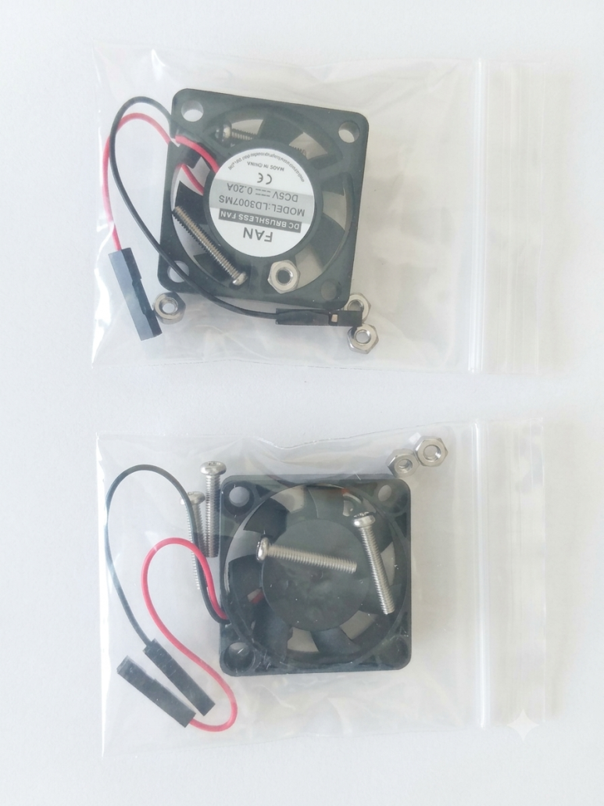
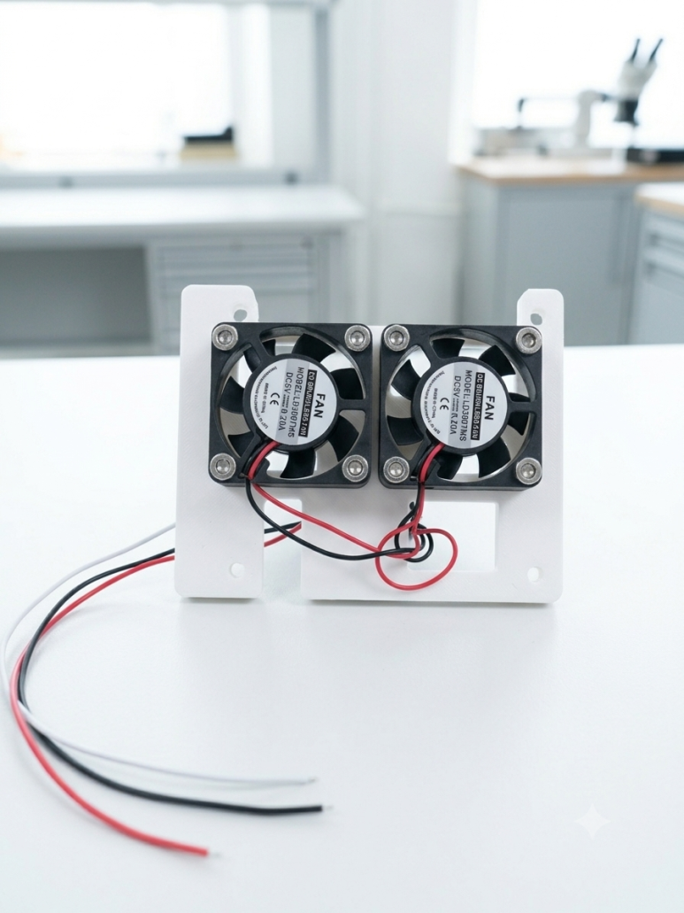
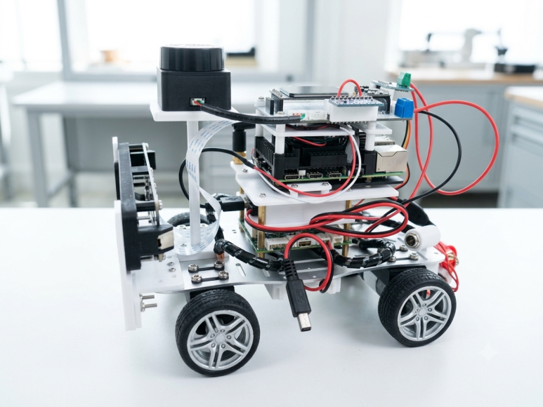

## Overview
When using the RDK X5 and GS130W, monitoring showed that BPU usage hovered close to 100%, accompanied by severe heat generation. Although it uses a heatsink case, back in early September when temperatures were higher (unlike the current cooler autumn weather), the temperature surged past 85°C in less than 30 minutes. I was concerned that the MIPI cable (22-pin FFC cable) on the camera side might touch the heatsink case and melt, so I had to power it down whenever it exceeded 80°C.

Therefore, active cooling was deemed necessary. However, since the setup was to be mounted on a vehicle, purchasing another case with built-in fans was not an option, so I decided to custom-build one.

## Purchasing Cooling Fans
For the cooling fans, I selected small-sized units rated at 30 x 30 x 7 mm. They featured low noise levels (15.92 dBA), long lifespan (30,000 hours), and supported 3.3V to 5V operation. A pack of 4 cost roughly 3,300 KRW.

## 3D Printing and Assembly
Upon connecting them after delivery, the airflow proved too weak, so I decided to install two fans. I designed the enclosure in Fusion 360 CAD for 3D printing, printed the parts, and assembled them.

## Assembled State
The final assembled state is as follows:

## Cooling Performance

After running roughly four 2-hour test sessions, thermal equilibrium was reached at approximately 61–64°C. Therefore, I tentatively conclude that stable operation is now possible. With the cooler weather recently, thermal equilibrium even reached as low as 56°C at night.

It is quite satisfying, especially because it operates silently. However, another issue is the increased power consumption. With an INA219 attached, current draw measured around 1.3 to 1.5A. Given that LiDAR, the GS130W, and overall CPU usage exceed 70%, this level of consumption is understandable.

## Another Issue, Battery

While this issue was somewhat predictable, three fully charged 18650 batteries lasted roughly 1 hour and 30 minutes. Beyond that point, Wi-Fi connectivity dropped out. It seems the bottleneck for AI edge deployment ultimately comes down to battery life.

Because the GS130W Stereo Camera heavily relies on the BPU, it generates significant heat and consumes a non-negligible amount of power. Combined with the LiDAR motor rotation and publishing ROS2 messages after enabling all sensors, heavy battery drain is inevitable.

Personally, having operated drones before, I have LiPo batteries on hand, but I avoid using them due to maintenance hassle. I plan to keep it that way. Since I do not spend all day driving an autonomous car around, testing with AC power during software development is completely fine.

## RDK X5 Evaluation

Over time, I have tested various setups and used 3D printing to mount hardware onto the vehicle. Despite many trial-and-error iterations, I can see myself handling these tasks much more smoothly than before. Although the CAD designs for 3D printing are somewhat rough around the edges rather than polished, they are tailored to fit my fixed hobby budget and available spare parts.

In the past, I ran YOLO object detection on an older desktop with an NVIDIA GPU just to display the output on a screen, but now I can perform both detection and depth estimation in a single setup. Granted, the stereonet is running a quantized version and the YOLO model requires NV12 format input, but the results are quite impressive for what it is.

Although it is bulkier and more cumbersome than an Intel RealSense, being able to replicate a depth camera setup at this price point is highly satisfying.

I used Raspberry Pis for 8 years without any issues, but time will tell how durable this board turns out to be. The downside of the RDK X5 is its reliance on vendor-specific OS images, which brings a mix of convenience and limitation. Still, it is manageable, and long-term usage will reveal its true durability.

With the 8GB version of the RDK X5, memory usage remains around 52% even with all autonomous driving and GS130W software packages loaded. The 4GB version likely would have struggled under the same load.

All in all, I am satisfied so far.
